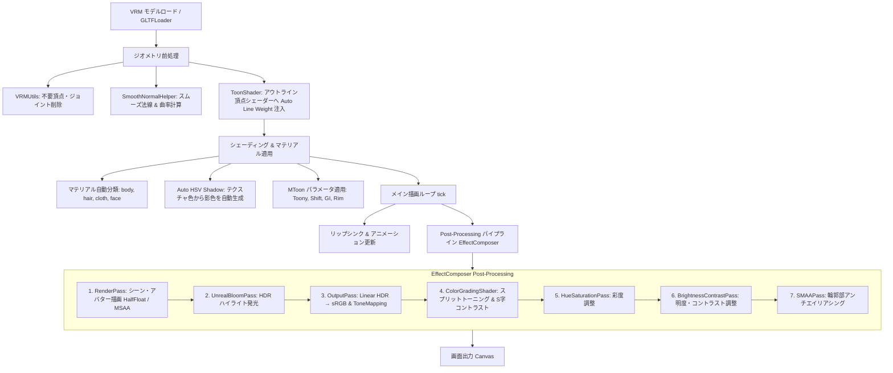

# AnimeVRM (VRM Toon Viewer)

アニメ・セル調（原神ライクなセルルック）表現を追求した WebGL / Three.js ベースの VRM アバタービューアです。

🌐 **Live Demo:** [https://uemegu.github.io/AnimeVRM/](https://uemegu.github.io/AnimeVRM/)

---

## 📖 目次

- [特徴](#-特徴)
- [クイックスタート](#-クイックスタート)
- [描画の流れ (Rendering Pipeline)](#-描画の流れ-rendering-pipeline)
  - [1. モデルロード & ジオメトリ前処理](#1-モデルロード--ジオメトリ前処理)
  - [2. トゥーンシェーディング & マテリアル処理](#2-トゥーンシェーディング--マテリアル処理)
  - [3. アウトライン生成 (反転法線押し出し法)](#3-アウトライン生成-反転法線押し出し法)
  - [4. ポストプロセス パイプライン](#4-ポストプロセス-パイプライン)
  - [5. アニメーション & アプリケーションループ](#5-アニメーション--アプリケーションループ)
- [設定パラメータ (Configuration)](#-設定パラメータ-configuration)
  - [マテリアル設定 (`materials`)](#1-マテリアル設定-materialsbody--hair--cloth)
  - [アウトライン設定 (`outline`)](#2-アウトライン設定-outline)
  - [ライティング設定 (`lighting`)](#3-ライティング設定-lighting)
  - [環境・背景設定 (`environment`)](#4-環境背景設定-environment)
  - [ポストプロセス設定 (`postProcessing`)](#5-ポストプロセス設定-postprocessing)
  - [カメラ・リップシンク・ショートアニメーション](#6-カメラリップシンクショートアニメーション)
- [設定の保存・読み込み (JSON)](#-設定の保存読み込み-json)
- [ディレクトリ構成](#-ディレクトリ構成)
- [技術スタック](#-技術スタック)

---

## ✨ 特徴

- **アニメ調シェーディング (MToon 最適化)**:
  - 肌・髪・衣装の自動マテリアル分類とパラメトリック調整
  - **Auto HSV Shadow**: テクスチャ平均色から肌の血色感（暖色シフト）や髪・衣装の青紫系影色を自動計算
  - 顔部分の不要な影落ち・割れを抑制するフェイシャル保護
- **高品質アウトライン (Inverted Hull)**:
  - **Smooth Normal (スムーズ法線)**: 頂点法線のハードエッジによる輪郭線破綻を解消
  - **Screen-Space Width**: カメラ距離に依存しない一定の輪郭線幅
  - **Auto Line Weight**: 視線角度（シルエット）に応じた線の抑揚自動補正
  - テクスチャ色に応じた自動輪郭線カラー（色相維持＋暗度・彩度調整）
- **ポストプロセス パイプライン (EffectComposer)**:
  - 映画・アニメ調 **スプリットトーニング (Color Grading)**（シャドウ: 寒色系 / ハイライト: 暖色系）
  - **UnrealBloomPass** によるやわらかな発光・グロー表現
  - **SMAA** (Subpixel Morphological Antialiasing) + **MSAA** によるジャギー低減
  - 柔軟なトーンマッピング (ACESFilmic, Reinhard, AgX, Linear, None)
- **モーション & 演出機能**:
  - Mixamo FBX モーションの VRM 自動リターゲティング再生
  - **ショートアニメーション演出**: 複数カット切り替え、カメラワーク、タイポグラフィ（前後レイヤー字幕）
  - **リアルタイム音声リップシンク**: Meyda を用いたスペクトル解析による母音推定
  - プロシージャルな自然な瞬き (Auto Blink)・カメラ目線追従 (LookAt)・呼吸

---

## 🚀 クイックスタート

```bash
# 依存パッケージのインストール
npm install

# 開発サーバー起動
npm run dev

# プロダクションビルド
npm run build

# ビルド成果物のプレビュー
npm run preview
```

---

## 🎨 描画の流れ (Rendering Pipeline)

AnimeVRM では、VRM モデルのロードから最終的な画面出力まで以下のパイプラインで描画を行います。



### 1. モデルロード & ジオメトリ前処理
- **ロードと最適化 (`Avatar.ts`)**:
  `@pixiv/three-vrm` の `VRMLoaderPlugin` を用いて VRM をロードし、`VRMUtils.removeUnnecessaryVertices` / `removeUnnecessaryJoints` で描画負荷を低減します。
- **スムーズ法線の事前計算 (`SmoothNormalHelper.ts`)**:
  モデルのハードエッジ（法線の不連続面）で裏面押し出しアウトラインが裂けてしまう現象を防ぐため、空間ハッシュマップを用いて同座標頂点の平均法線（`smoothNormal`）と曲率（`curvature`）をロード時に事前計算します。
- **Auto Line Weight 注入 (`ToonShader.ts`)**:
  アウトライン用 MToon マテリアルの `onBeforeCompile` をフックし、頂点シェーダー内に視線角度ベクトルとの内積（`dotNV`）に応じた線の太さ変調コードを動的に挿入します。

### 2. トゥーンシェーディング & マテリアル処理
- **パーツ分類**:
  メッシュ名・マテリアル名の正規表現から `body`（体・肌）、`hair`（髪）、`cloth`（衣装）、`face`（顔）に自動分類します。
- **Auto HSV Shadow (自動影色計算)**:
  マテリアルテクスチャのピクセル平均色を抽出し、HSL 色空間で最適な影色を自動算出します。
  - **肌・顔**: 暖色（ピーチ〜赤系）へシフトし、皮下散乱のような血色感のある影色を生成（顔は体と影色を同期）。
  - **髪・衣装**: 彩度を高めつつクールな青紫系へシフトさせ、アニメ調の鮮やかな陰影を生成。
- **フェイシャル保護**:
  顔パーツ（`face`）に対しては、不自然な影の割れやチークの削れを防ぐため、`shadingShiftFactor` の下限制限やリムライト発光の抑制処理を行います。

### 3. アウトライン生成 (反転法線押し出し法)
- MToon 標準の裏面押し出し方式（Inverted Hull）を利用。
- 前処理で計算された `smoothNormal` を法線として参照することで、角ばったメッシュでも滑らかで途切れない輪郭線を生成。
- `outlineWidthMode = 'screenCoordinates'` により、カメラが遠ざかっても線が極端に細くならず一定の視認性を保持。
- 輪郭線の色はテクスチャ平均色から明度を下げ、彩度を微増させた色（`getDarkenedOutlineColor`）を自動適用。

### 4. ポストプロセス パイプライン
`EffectComposer`（レンダーターゲット: `HalfFloatType`, `MSAA: 4`）上で以下の順にパスを実行します。

| 順序 | パス名 | 役割・処理内容 |
| :--- | :--- | :--- |
| **1** | `RenderPass` | 背景・床・VRM モデルを 3D シーンとして描画 |
| **2** | `UnrealBloomPass` | 高輝度部分を抽出してぼかし、ふんわりとしたグロー（光の溢れ）を付加 |
| **3** | `OutputPass` | Linear HDR 色空間から sRGB への変換およびトーンマッピングの適用 |
| **4** | `ColorGradingPass` | 影（`uShadowTint`）とハイライト（`uHighlightTint`）の個別着色（スプリットトーニング）＋S字コントラストカーブ |
| **5** | `HueSaturationPass` | 全体の鮮やかさ（彩度）をアニメ向けに調整 |
| **6** | `BrightnessContrastPass` | 全体の明度とコントラストの微調整 |
| **7** | `SMAAPass` | 最終的な sRGB 画像のエッジに対してアンチエイリアシングを適用 |

### 5. アニメーション & アプリケーションループ
毎フレームの `tick()` ループ内で以下を同期して更新します：
1. **ショートアニメーション / カメラワーク**: カット毎のカメラ位置補間・画角制御・タイポグラフィ更新
2. **リップシンク**: 音声入力（マイク/音声ファイル）から Meyda で抽出した周波数特徴量に基づき、母音（`aa, ee, ih, oh, ou`）のモーフターゲット重みをブレンド
3. **VRM 状態更新**: SpringBone（揺れもの物理）、まばたき、LookAt、Mixer アニメーション更新

---

## ⚙️ 設定パラメータ (Configuration)

設定は `src/Config.ts` の `AvatarConfig` インターフェースで一元管理されており、画面右上の GUI（lil-gui）からリアルタイムに変更可能です。

### 1. マテリアル設定 (`materials.body` / `hair` / `cloth`)

各部位（肌、髪、衣装）ごとに独立したセルルックパラメータを保持します。

| パラメータ名 | 型 | デフォルト (body) | 説明 |
| :--- | :--- | :--- | :--- |
| `color` | `string` | `#fffafa` | 基本色・血色感（Base Color / Tint） |
| `shadowHueShift` | `number` | `0.02` | 影色の色相シフト量（正: 暖色寄り, 負: 寒色寄り） |
| `shadowLightnessFactor` | `number` | `0.16` | 影色の明度比率（低いほど影が濃くなる） |
| `shadingToonyFactor` | `number` | `1.0` | トゥーンの硬さ（`1.0` で完全なセル調2値境界） |
| `shadingShiftFactor` | `number` | `-0.05` | 明暗境界の位置オフセット |
| `giEqualizationFactor` | `number` | `0.9` | 環境光の均一化率（アニメ調のフラットさを向上） |
| `rimEnabled` | `boolean` | `false` | パラメトリックリムライトの有効/無効 |
| `rimColor` | `string` | `#ffffff` | リムライトの発光色 |
| `parametricRimFresnelPowerFactor` | `number` | `5.0` | リムの急峻度（高いほどシルエットの端だけに絞られる） |
| `parametricRimLiftFactor` | `number` | `0.1` | リム光の持ち上げ量 |
| `rimLightingMixFactor` | `number` | `0.1` | 光源方向によるリムの変調比率 |
| `outlineWidthFactor` | `number` | `0.001` | 個別のアウトライン太さ係数 |

### 2. アウトライン設定 (`outline`)

| パラメータ名 | 型 | デフォルト | 説明 |
| :--- | :--- | :--- | :--- |
| `enabled` | `boolean` | `true` | アウトライン（輪郭線）の表示 ON/OFF |
| `useSmoothNormal` | `boolean` | `true` | スムーズ法線による線の裂け防止 |
| `screenSpaceWidth` | `boolean` | `true` | 画面空間固定幅（距離による線幅減衰の防止） |
| `autoLineWeight` | `boolean` | `true` | 視線角度・法線向きによる線の抑揚自動調整 |
| `darknessFactor` | `number` | `0.1` | 輪郭線の暗さ係数（ベース色からの暗度） |
| `widthFactor` | `number` | `0.001` | 輪郭線の太さ基準値 |
| `lightingMixFactor` | `number` | `0.0` | ライティングによる輪郭線色の変化度合い |

### 3. ライティング設定 (`lighting`)

| パラメータ名 | 型 | デフォルト | 説明 |
| :--- | :--- | :--- | :--- |
| `castShadows` | `boolean` | `false` | シャドウマップによる落ち影の有無 |
| `ambient.color` | `string` | `#ffb8b8` | 環境光（アンビエントライト）の色 |
| `ambient.intensity` | `number` | `0.35` | 環境光の強度 |
| `directional.color` | `string` | `#ffffff` | 主光源（ディレクショナルライト）の色 |
| `directional.intensity` | `number` | `2.6` | 主光源の強度 |
| `directional.posX / Y / Z` | `number` | `4.1 / 2.5 / 2.0` | 主光源の 3D 位置 |
| `rim.enabled` | `boolean` | `true` | 補助環境リム光の有効/無効 |
| `rim.color` | `string` | `#dde8ff` | 補助環境リム光の色 |
| `rim.intensity` | `number` | `0.05` | 補助環境リム光の強度 |
| `rim.posX / Y / Z` | `number` | `-2.0 / 2.5 / -2.0` | 補助環境リム光の位置（後方逆光位置） |

### 4. 環境・背景設定 (`environment`)

| パラメータ名 | 型 | デフォルト | 説明 |
| :--- | :--- | :--- | :--- |
| `showBackgroundImage` | `boolean` | `true` | 背景テクスチャ画像の表示 ON/OFF |
| `backgroundImageUrl` | `string` | `/textures/park-background.jpg` | 背景画像の URL / パス |
| `backgroundColor` | `string` | `#ffffff` | 単色背景モード時の背景色 |
| `showFloor` | `boolean` | `false` | 足元グリッド床の表示 ON/OFF |
| `floorColor` | `string` | `#ffffff` | 床面のマテリアルカラー |

### 5. ポストプロセス設定 (`postProcessing`)

| パラメータ名 | 型 | デフォルト | 説明 |
| :--- | :--- | :--- | :--- |
| `toneMappingMode` | `string` | `'None'` | トーンマッピング (`'ACESFilmic'`, `'Reinhard'`, `'AgX'`, `'Linear'`, `'None'`) |
| `toneMappingExposure` | `number` | `1.0` | 露出強度 |
| `antialiasing.msaaSamples` | `number` | `4` | MSAA サンプリング数 (0, 2, 4, 8) |
| `antialiasing.smaa` | `boolean` | `true` | SMAA (Subpixel Morphological AA) の有効化 |
| `bloom.enabled` | `boolean` | `true` | ブルーム効果の有効/無効 |
| `bloom.strength` | `number` | `0.09` | ブルームの強さ |
| `bloom.radius` | `number` | `0.16` | ブルームの拡散半径 |
| `bloom.threshold` | `number` | `0.85` | 発光する輝度のしきい値 |
| `colorGrading.enabled` | `boolean` | `true` | スプリットトーニング・カラーグレーディングの有効化 |
| `colorGrading.shadowTint` | `string` | `#5471f2` | 影（暗部）に乗せるティントカラー |
| `colorGrading.highlightTint`| `string` | `#ffffff` | ハイライト（明部）に乗せるティントカラー |
| `colorGrading.strength` | `number` | `0.5` | カラーグレーディングのブレンド強度 |
| `colorGrading.contrast` | `number` | `0.13` | S字コントラスト強度 |
| `colorGrading.gamma` | `number` | `1.0` | ガンマ補正値 |
| `saturation` | `number` | `0.26` | 全体彩度補正オフセット |
| `brightness` | `number` | `0.0` | 全体明度補正オフセット |
| `contrast` | `number` | `0.0` | 全体コントラスト補正オフセット |

### 6. カメラ・リップシンク・ショートアニメーション

- **`camera`**: 初期画角 (`fov: 30`), カメラ位置 (`x, y, z`), ターゲット位置, ズーム距離範囲
- **`lipSync`**: 音声リップシンクのゲイン (`gain: 1.5`), 追従スムージング係数 (`smoothing: 0.45`), 判定閾値 (`rmsThreshold: 0.008`)
- **`shortAnimation.cuts[]`**:
  - `duration`: カットの再生時間（秒）
  - `startAngle`: 開始カメラアングル（`front`, `farFront`, `right`, `left`, `lowAngle`, `closeUp`, `continue`）
  - `cameraPreset`: カメラワーク（`pushIn`, `pullOut`, `orbitLeft`, `orbitLeftHalf`, `lowAngleUp`, `punchIn` 等）
  - `motion`: カット時に再生する FBX アニメーション
  - `backText` / `frontText`: 前面・背面のタイポグラフィテキスト、文字色、フォントサイズ、アニメーションプリセット（`slideLeft`, `scaleIn`, `punch`, `fade` 等）

---

## 💾 設定の保存・読み込み (JSON)

GUI の最上部にある「💾 設定JSON エクスポート / 読込」から現在の設定状態を自在に管理できます。

- **📋 設定JSONをコピー**: 現在の全パラメータ設定をクリップボードに JSON 文字列としてコピー
- **💾 JSONファイル保存**: `avatar-config.json` としてローカルにダウンロード
- **📥 JSONを読み込み**: 保存した JSON を貼り付けて即座に全パラメータへ反映
- **🔄 デフォルトにリセット**: 初期プリセット設定へ復元

---

## 📁 ディレクトリ構成

```text
vrm-genshin-like/
├── public/
│   ├── animations/        # 待機・歩行・ダンス等の Mixamo FBX アニメーション
│   ├── models/            # サンプル VRM モデル (girl.vrm, avatar.vrm 等)
│   ├── textures/          # 背景画像 (park-background.jpg, room-background.jpg)
│   └── voice/             # リップシンク検証用音声ファイル
├── src/
│   ├── animation/
│   │   ├── ShortAnimationPlayer.ts  # ショート演出再生・カメラ補間・カット管理
│   │   ├── TypographyOverlay.ts     # タイポグラフィ（文字演出）の描画
│   │   └── types.ts                 # アニメーション型定義
│   ├── shader/
│   │   └── SmoothNormalHelper.ts    # スムーズ法線・曲率計算ユーティリティ
│   ├── utils/
│   │   └── path.ts                  # ベースパス解決ユーティリティ
│   ├── AudioLipSync.ts              # Meyda を用いた音声解析 & リップシンク制御
│   ├── Avatar.ts                    # VRM ロード、マテリアル適用、モーション制御
│   ├── ColorGradingShader.ts        # スプリットトーニング & S字コントラストシェーダー
│   ├── Config.ts                    # 全設定パラメータの型定義・デフォルト値・JSON入出力
│   ├── ToonShader.ts                # MToon パラメータ制御・Auto HSV 影色計算・アウトライン制御
│   ├── main.ts                      # Three.js シーン構築、EffectComposer、GUI、メインループ
│   └── style.css                    # UI スタイル
├── index.html
├── package.json
└── vite.config.ts
```

---

## 🛠️ 技術スタック

- **3D Engine**: [Three.js](https://threejs.org/) (r183)
- **VRM Support**: [@pixiv/three-vrm](https://github.com/pixiv/three-vrm) (v3.5)
- **Audio Analysis**: [Meyda](https://meyda.js.org/) (Audio feature extraction for Lip-Sync)
- **UI / Controls**: [lil-gui](https://lil-gui.georgealways.com/)
- **Bundler & Tooling**: [Vite](https://vitejs.dev/), TypeScript