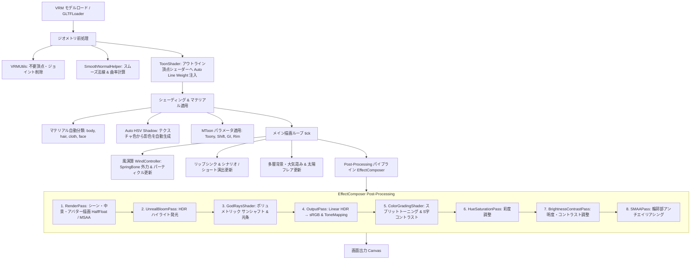

# AnimeVRM (VRM Toon Viewer)

アニメ・セル調表現を追求した WebGL / Three.js ベースの VRM アバタービューア＆アニメーション演出エンジンです。

🌐 **Live Demo:** [https://uemegu.github.io/AnimeVRM/](https://uemegu.github.io/AnimeVRM/)

---

## 📖 目次

- [✨ 特徴](#-特徴)
- [🚀 クイックスタート](#-クイックスタート)
- [🎨 描画 & 演出パイプライン](#-描画--演出パイプライン)
  - [1. モデルロード & ジオメトリ前処理](#1-モデルロード--ジオメトリ前処理)
  - [2. トゥーンシェーディング & マテリアル処理](#2-トゥーンシェーディング--マテリアル処理)
  - [3. 高品質アウトライン (反転法線押し出し法)](#3-高品質アウトライン-反転法線押し出し法)
  - [4. 環境光・太陽光・大気エフェクト](#4-環境光太陽光大気エフェクト)
  - [5. 風・環境物理・パーティクル](#5-風環境物理パーティクル)
  - [6. ポストプロセス パイプライン](#6-ポストプロセス-パイプライン)
  - [7. シナリオ会話 & ショートアニメーション](#7-シナリオ会話--ショートアニメーション)
- [⚙️ 設定パラメータ (Configuration)](#️-設定パラメータ-configuration)
  - [マテリアル設定 (`materials`)](#1-マテリアル設定-materialsbody--hair--cloth)
  - [アウトライン設定 (`outline`)](#2-アウトライン設定-outline)
  - [ライティング・太陽・フレア設定 (`lighting`)](#3-ライティング太陽フレア設定-lighting)
  - [環境・多層背景設定 (`environment`)](#4-環境多層背景設定-environment)
  - [風・パーティクル設定 (`wind`)](#5-風パーティクル設定-wind)
  - [ポストプロセス設定 (`postProcessing`)](#6-ポストプロセス設定-postprocessing)
  - [カメラ・リップシンク・ショート演出](#7-カメラリップシンクショート演出)
- [💾 設定の保存・読み込み (JSON)](#-設定の保存読み込み-json)
- [📁 ディレクトリ構成](#-ディレクトリ構成)
- [🛠️ 技術スタック](#️-技術スタック)

---

## ✨ 特徴

- **セルルックシェーディング (MToon 最適化)**:
  - 肌・髪・衣装の自動マテリアル分類とパラメトリック調整
  - **Auto HSV Shadow**: テクスチャ平均色から肌の血色感（暖色シフト）や髪・衣装の青紫系影色を自動計算
  - 顔部分の不要な影落ち・割れを抑制するフェイシャル保護
- **高品質アウトライン (Inverted Hull)**:
  - **Smooth Normal (スムーズ法線)**: 頂点法線のハードエッジによる輪郭線破綻を解消
  - **Screen-Space Width**: カメラ距離に依存しない一定の輪郭線幅
  - **Auto Line Weight**: 視線角度（シルエット）に応じた線の抑揚自動補正
  - テクスチャ色に応じた自動輪郭線カラー（色相維持＋暗度・彩度調整）
- **太陽光・レンズフレア・大気エフェクト**:
  - **God Rays (Sun Shafts)**: スクリーン空間でのボリュメトリックな光条・木漏れ日・シマー（陽炎・空気の揺らぎ）
  - **アニメ調プロシージャル Lens Flare**: 太陽本体、グロー、スターバースト放射光、アナモルフィック・ストリークフレア、ゴーストリング、ハロー
  - **大気霞み (Far Fog)**: 遠景の地平線・空に合わせたグラデーション空気層
- **多層背景システム (Layered Background & Keying)**:
  - 遠景＋中景（クロマキー/ルミナンスキーイング自動透過プレーン）による奥行き・視差表現
  - OrbitControls のパン操作に応じた中景プレーンのスマート追従
- **風・環境物理 & 花びらパーティクル連動**:
  - **WindController**: 風速・風向（方位角/仰角）・乱流（Turbulence）・突風（Gust）をリアルタイム計算し、VRM SpringBone（髪や衣装の揺れもの）の外力へダイナミックに反映
  - **WindParticles**: 風向・風速に合わせて空間をひらひらと舞い踊る小さな花びら（桜・リーフ）演出
- **アドベンチャー会話シナリオ & リアルタイムリップシンク**:
  - **ScenarioPlayer**: 音声ファイル再生・Meyda スペクトル解析による口形状（モーフターゲット）同期
  - 表情変化、モーション切り替え、タイプライター風メッセージウィンドウ、BGM・環境SE（蝉の声など）を統合したストーリーテリング
- **ショートアニメーション & タイポグラフィ演出**:
  - マルチカット切り替え、カメラワークプリセット（pushIn, pullOut, orbit, lowAngle, punchIn）
  - 前面・背面のタイポグラフィ（前後レイヤー字幕演出）
- **ワンクリック シーンプリセット**:
  - 朝・夕の公園・学校、明るい部屋、暗い部屋（髪ハイライト自動消灯）などのプリセットでライティング・背景・ポストプロセス・風を即座に最適化

---

## 🚀 クイックスタート

```bash
# 依存パッケージのインストール
npm install

# 開発サーバー起動
npm run dev

# プロダクションビルド
npm run build

# ビルド成果物のプレビュー
npm run preview
```

---

## 🎨 描画 & 演出パイプライン

AnimeVRM では、VRM モデルのロードから物理演算、シェーディング、多層エフェクト、最終ポストプロセスまで以下のパイプラインで描画を行います。



### 1. モデルロード & ジオメトリ前処理
- **ロードと最適化 (`Avatar.ts`)**:
  `@pixiv/three-vrm` の `VRMLoaderPlugin` を用いて VRM をロードし、`VRMUtils.removeUnnecessaryVertices` / `removeUnnecessaryJoints` で描画負荷を低減します。
- **スムーズ法線の事前計算 (`SmoothNormalHelper.ts`)**:
  モデルのハードエッジ（法線の不連続面）で裏面押し出しアウトラインが裂けてしまう現象を防ぐため、空間ハッシュマップを用いて同座標頂点の平均法線（`smoothNormal`）と曲率（`curvature`）をロード時に事前計算します。
- **Auto Line Weight 注入 (`ToonShader.ts`)**:
  アウトライン用 MToon マテリアルの `onBeforeCompile` をフックし、頂点シェーダー内に視線角度ベクトルとの内積（`dotNV`）に応じた線の太さ変調コードを動的に挿入します。

### 2. トゥーンシェーディング & マテリアル処理
- **パーツ分類**:
  メッシュ名・マテリアル名の正規表現から `body`（体・肌）、`hair`（髪）、`cloth`（衣装）、`face`（顔）に自動分類します。
- **Auto HSV Shadow (自動影色計算)**:
  マテリアルテクスチャのピクセル平均色を抽出し、HSL 色空間で最適な影色を自動算出します。
  - **肌・顔**: 暖色（ピーチ〜赤系）へシフトし、皮下散乱のような血色感のある影色を生成（顔は体と影色を同期）。
  - **髪・衣装**: 彩度を高めつつクールな青紫系へシフトさせ、アニメ調の鮮やかな陰影を生成。
- **フェイシャル保護**:
  顔パーツ（`face`）に対しては、不自然な影の割れやチークの削れを防ぐため、`shadingShiftFactor` の下限制限やリムライト発光の抑制処理を行います。

### 3. 高品質アウトライン (反転法線押し出し法)
- MToon 標準の裏面押し出し方式（Inverted Hull）を利用。
- 前処理で計算された `smoothNormal` を法線として参照することで、角ばったメッシュでも滑らかで途切れない輪郭線を生成。
- `outlineWidthMode = 'screenCoordinates'` により、カメラが遠ざかっても線が極端に細くならず一定の視認性を保持。
- 輪郭線の色はテクスチャ平均色から明度を下げ、彩度を微増させた色（`getDarkenedOutlineColor`）を自動適用。

### 4. 環境光・太陽光・大気エフェクト
- **多層背景 (`main.ts`)**: 遠景画像に大気霞み（`loadAtmosphericBackground`）のグラデーションをブレンド。中景画像は自動ルミナンスキーイングで白背景を透過し、カメラのパン操作に連動するビルボードプレーンとして描画。
- **サンシャフト・ゴッドレイ (`GodRaysShader.ts`)**: 太陽位置から放射状にスクリーンサンプリングを行い、光条とシマー（揺らぎ）を付加。
- **レンズフレア (`SunEffect.ts`)**: 太陽光源と画面中心を結ぶ軸上に、アナモルフィックフレア、ゴーストリング、スターバースト光をプロシージャル描画。

### 5. 風・環境物理・パーティクル
- **風コントローラー (`WindController.ts`)**:
  ベース風向・風速に加えてパーリンノイズ風の乱流（Turbulence）と突風（Gust）を重ね合わせた 3D ベクトルを毎フレーム計算。VRM の `SpringBone` に外力ベクトルとして注入し、自然な揺らぎを実現。
- **風パーティクル (`WindParticles.ts`)**:
  風向と風速に同期して舞う光の粒子を Instanced/Points で描画。

### 6. ポストプロセス パイプライン
`EffectComposer`（レンダーターゲット: `HalfFloatType`, `MSAA: 4`）上で以下の順にパスを実行します。

| 順序 | パス名 | 役割・処理内容 |
| :--- | :--- | :--- |
| **1** | `RenderPass` | 背景・中景・床・VRM モデルを 3D シーンとして描画 |
| **2** | `UnrealBloomPass` | 高輝度部分を抽出してぼかし、ふんわりとしたグロー（光の溢れ）を付加 |
| **3** | `GodRaysShader` | 太陽光源を中心としたボリュメトリックな光条（サンシャフト）を描画 |
| **4** | `OutputPass` | Linear HDR 色空間から sRGB への変換およびトーンマッピングの適用 |
| **5** | `ColorGradingPass` | 影（`uShadowTint`）とハイライト（`uHighlightTint`）の個別着色（スプリットトーニング）＋S字コントラストカーブ |
| **6** | `HueSaturationPass` | 全体の鮮やかさ（彩度）をアニメ向けに調整 |
| **7** | `BrightnessContrastPass` | 全体の明度とコントラストの微調整 |
| **8** | `SMAAPass` | 最終的な sRGB 画像のエッジに対してアンチエイリアシングを適用 |

### 7. シナリオ会話 & ショートアニメーション
- **シナリオプレイヤー (`ScenarioPlayer.ts` / `AdventureMessageWindow.ts`)**:
  テキスト、音声、リップシンク、表情、FBX モーション、BGM、環境SE をステップ順にシームレス再生。
- **ショートアニメーション (`ShortAnimationPlayer.ts` / `TypographyOverlay.ts`)**:
  カット割り（画角・カメラワーク・時間）と前後タイポグラフィ（文字演出アニメーション）を同期再生。

---

## ⚙️ 設定パラメータ (Configuration)

設定は `src/Config.ts` の `AvatarConfig` インターフェースで一元管理されており、GUI（lil-gui）からリアルタイムに変更可能です。

### 1. マテリアル設定 (`materials.body` / `hair` / `cloth`)

各部位（肌、髪、衣装）ごとに独立したセルルックパラメータを保持します。

| パラメータ名 | 型 | デフォルト (body) | 説明 |
| :--- | :--- | :--- | :--- |
| `color` | `string` | `#fffafa` | 基本色・血色感（Base Color / Tint） |
| `matcapEnabled` | `boolean` | `true` | ハイライト (MatCap / スフィアマップ) の表示 ON/OFF |
| `shadowHueShift` | `number` | `0.02` | 影色の色相シフト量（正: 暖色寄り, 負: 寒色寄り） |
| `shadowLightnessFactor` | `number` | `0.16` | 影色の明度比率（低いほど影が濃くなる） |
| `shadingToonyFactor` | `number` | `1.0` | トゥーンの硬さ（`1.0` で完全なセル調2値境界） |
| `shadingShiftFactor` | `number` | `-0.05` | 明暗境界の位置オフセット |
| `giEqualizationFactor` | `number` | `0.9` | 環境光の均一化率（アニメ調のフラットさを向上） |
| `rimEnabled` | `boolean` | `true` | パラメトリックリムライトの有効/無効 |
| `rimColor` | `string` | `#ffffff` | リムライトの発光色 |
| `parametricRimFresnelPowerFactor` | `number` | `5.0` | リムの急峻度（高いほどシルエットの端だけに絞られる） |
| `parametricRimLiftFactor` | `number` | `0.1` | リム光の持ち上げ量 |
| `rimLightingMixFactor` | `number` | `0.1` | 光源方向によるリムの変調比率 |
| `outlineWidthFactor` | `number` | `0.001` | 個別のアウトライン太さ係数 |

### 2. アウトライン設定 (`outline`)

| パラメータ名 | 型 | デフォルト | 説明 |
| :--- | :--- | :--- | :--- |
| `enabled` | `boolean` | `true` | アウトライン（輪郭線）の表示 ON/OFF |
| `useSmoothNormal` | `boolean` | `true` | スムーズ法線による線の裂け防止 |
| `screenSpaceWidth` | `boolean` | `true` | 画面空間固定幅（距離による線幅減衰の防止） |
| `autoLineWeight` | `boolean` | `true` | 視線角度・法線向きによる線の抑揚自動調整 |
| `darknessFactor` | `number` | `0.1` | 輪郭線の暗さ係数（ベース色からの暗度） |
| `widthFactor` | `number` | `0.001` | 輪郭線の太さ基準値 |
| `lightingMixFactor` | `number` | `0.0` | ライティングによる輪郭線色の変化度合い |

### 3. ライティング・太陽・フレア設定 (`lighting`)

| パラメータ名 | 型 | デフォルト | 説明 |
| :--- | :--- | :--- | :--- |
| `castShadows` | `boolean` | `false` | シャドウマップによる落ち影の有無 |
| `ambient.color` / `intensity` | `string` / `number` | `#3e407a` / `0.5` | 環境光の色と強度 |
| `directional.color` / `intensity` | `string` / `number` | `#fffbf0` / `1.8` | 主光源の色と強度 |
| `directional.posX / Y / Z` | `number` | `-3.7 / 0.8 / 0.7` | 主光源の 3D 位置 |
| `rim.enabled` / `color` / `intensity` | `boolean` / `string` / `number` | `true` / `#ffaa60` / `0.3` | 補助環境リム光 |
| `depthRim.enabled` / `power` / `intensity` | `boolean` / `number` / `number` | `true` / `3.5` / `1.0` | 深度リムライト効果 |
| `sunShafts.enabled` / `color` / `exposure` | `boolean` / `string` / `number` | `true` / `#ff7826` / `0.36` | 太陽光条（God Rays） |
| `sunShafts.decay` / `density` / `weight` | `number` | `0.83 / 0.5 / 0.48` | サンシャフトの減衰・密度・重み |
| `sunShafts.shimmer` | `number` | `0.25` | サンシャフトの陽炎・揺らぎ強度 |
| `lensFlare.enabled` / `sunColor` / `sunSize` | `boolean` / `string` / `number` | `true` / `#ff6222` / `1.05` | アニメ調レンズフレア |
| `lensFlare.glowIntensity` / `starburstIntensity` | `number` | `1.15 / 1.05` | グロー / 放射光強度 |
| `lensFlare.anamorphicIntensity` / `ghostIntensity` | `number` | `0.95 / 0.95` | 横長ストリーク光 / ゴースト強度 |

### 4. 環境・多層背景設定 (`environment`)

| パラメータ名 | 型 | デフォルト | 説明 |
| :--- | :--- | :--- | :--- |
| `showBackgroundImage` | `boolean` | `true` | 背景テクスチャ画像の表示 ON/OFF |
| `backgroundImageUrl` | `string` | `/textures/modern-park-far.jpg` | 遠景画像の URL / パス |
| `backgroundColor` | `string` | `#2b101d` | 単色背景モード時の背景色 |
| `showFloor` / `floorColor` | `boolean` | `false` / `#ffffff` | 床面グリッドの表示 / カラー |
| `showMidground` | `boolean` | `true` | 中景レイヤーの表示 ON/OFF |
| `midgroundImageUrl` | `string` | `/textures/modern-park-mid.jpg` | 中景画像の URL / パス |
| `midgroundScale` / `midgroundOpacity` | `number` | `1.15 / 1.0` | 中景プレーンのスケール / 不透明度 |
| `farFogEnabled` / `farFogColor` / `farFogIntensity` | `boolean` / `string` / `number` | `true` / `#ff7e4d` / `0.08` | 遠景の大気霞み（フォグ）設定 |

### 5. 風・パーティクル設定 (`wind`)

| パラメータ名 | 型 | デフォルト | 説明 |
| :--- | :--- | :--- | :--- |
| `enabled` | `boolean` | `true` | 風物理演算の有効化 |
| `speed` | `number` | `0.1` | 基準風速 |
| `direction` | `number` | `45` (deg) | 風向（水平方位角 0〜360度） |
| `elevation` | `number` | `5` (deg) | 風向（垂直仰角 -45〜45度） |
| `turbulence` | `number` | `0.15` | 乱流（微細なランダム揺らぎ）の強さ |
| `gustFrequency` / `gustStrength` | `number` | `0.2 / 0.15` | 突風の発生頻度と強さ |
| `particles.enabled` / `count` | `boolean` / `number` | `false / 160` | 風パーティクル（光の粒子）表示・個数 |
| `particles.color` / `size` / `opacity` | `string` / `number` | `#e2f8ff / 0.035 / 0.8` | パーティクル色・サイズ・透明度 |

### 6. ポストプロセス設定 (`postProcessing`)

| パラメータ名 | 型 | デフォルト | 説明 |
| :--- | :--- | :--- | :--- |
| `toneMappingMode` | `string` | `'None'` | トーンマッピング (`'ACESFilmic'`, `'Reinhard'`, `'AgX'`, `'Linear'`, `'None'`) |
| `toneMappingExposure` | `number` | `1.0` | 露出強度 |
| `antialiasing.msaaSamples` | `number` | `4` | MSAA サンプリング数 (0, 2, 4, 8) |
| `antialiasing.smaa` | `boolean` | `true` | SMAA (Subpixel Morphological AA) の有効化 |
| `bloom.enabled` | `boolean` | `true` | ブルーム効果の有効/無効 |
| `bloom.strength` / `radius` / `threshold` | `number` | `0.15 / 0.22 / 0.78` | ブルーム強度・半径・しきい値 |
| `colorGrading.enabled` | `boolean` | `true` | スプリットトーニング・カラーグレーディングの有効化 |
| `colorGrading.shadowTint` | `string` | `#391752` | 影（暗部）に乗せるティントカラー |
| `colorGrading.highlightTint`| `string` | `#ffad70` | ハイライト（明部）に乗せるティントカラー |
| `colorGrading.strength` / `contrast` / `gamma` | `number` | `0.65 / 0.18 / 0.95` | ブレンド強度・S字コントラスト・ガンマ |
| `saturation` / `brightness` / `contrast` | `number` | `0.26 / -0.04 / 0.08` | 全体彩度・明度・コントラスト補正 |

### 7. カメラ・リップシンク・ショート演出

- **`camera`**: 初期画角 (`fov: 30`), カメラ位置 (`x, y, z`), ターゲット位置, ズーム距離範囲
- **`lipSync`**: 音声リップシンクのゲイン (`gain: 0.65`), 追従スムージング係数 (`smoothing: 0.17`), 判定閾値 (`rmsThreshold: 0.008`), 音声遅延補正 (`audioDelay: 0.05`), 声質 (`voiceGender: 'female' | 'male'`)
- **`shortAnimation.cuts[]`**: カット毎の再生時間、開始アングル、カメラワークプリセット、モーション、前後タイポグラフィ（文字・色・フォントサイズ・アニメーションプリセット）

---

## 🎬 シーンプリセットとデフォルトパラメータ差分 (Scene Presets)

ワンクリックで切り替え可能な 6 種類のシーンプリセットにおける各設定項目の差分一覧です。

### 📊 プリセット別パラメータ比較表

| プリセット | カテゴリ | 背景画像 / 多層 | 主光源 (Dir Light) | 環境光 (Ambient) | サンシャフト (God Rays) | レンズフレア | カラーグレーディング (影/明) | 風・花びら | 髪ハイライト |
| :--- | :--- | :--- | :--- | :--- | :--- | :--- | :--- | :--- | :--- |
| **🌅 朝・公園 (`morning_park`)** | 屋外 | 近代公園 (far + mid 2層) | `#ffffff` / `2.6` (右上高) | `#ffb8b8` / `0.35` | 有効 (白黄 `#fff2db` / `0.24`) | 有効 (白黄 `#fff8ee`) | `#5471f2` (青紫) / `#ffffff` | **ON** | **ON** |
| **🌇 夕方・公園 (`evening_park`)** ★デフォルト | 屋外 | 近代公園 (far + mid 2層) | `#fffbf0` / `1.8` (左低) | `#3e407a` / `0.50` | 有効 (茜色 `#ff7826` / `0.36`) | 有効 (夕日色 `#ff6222`) | `#391752` (濃紫) / `#ffad70` (橙) | **ON** | **ON** |
| **🌅 朝・校門 (`morning_school`)** | 屋外 | 校門前 (far 単層) | `#ffffff` / `2.6` (右上高) | `#ffb8b8` / `0.35` | 有効 (白黄 `#fff2db` / `0.24`) | 有効 (白黄 `#fff8ee`) | `#5471f2` (青紫) / `#ffffff` | **ON** | **ON** |
| **🌇 夕方・校門 (`evening_school`)** | 屋外 | 校門前 (far 単層) | `#fffbf0` / `1.8` (左低) | `#3e407a` / `0.50` | 有効 (茜色 `#ff7826` / `0.36`) | 有効 (夕日色 `#ff6222`) | `#391752` (濃紫) / `#ffad70` (橙) | **ON** | **ON** |
| **💡 明るい・室内 (`bright_indoor`)** | 室内 | 教室廊下 (far 単層) | `#ffffff` / `2.2` (左上) | `#ffebeb` / `0.65` (高輝度) | **OFF** | **OFF** | `#505068` (灰) / `#ffffff` | **OFF** | **ON** |
| **🌙 暗い・室内 (`dark_indoor`)** | 室内 | 教室廊下 (far 単層) | `#b7cdf0` / `2.5` (夜光青) | `#ffebeb` / `0.30` (低照度) | 有効 (月光青 `#7898d0` / `0.10`) | **OFF** | `#1c1c30` (夜闇) / `#c8d8f0` (月光) | **OFF** | **OFF (自動消灯)** |

---

### 🔍 各シーンプリセットの設計意図と詳細差分

#### 1. 🌅 朝・公園 (`morning_park`) / 朝・校門 (`morning_school`)
- **コンセプト**: 爽やかな青空と澄んだ朝陽。抜けの良い大気感と高コントラストな昼光アニメ調。
- **ライティング**: 主光源は右上高所（`posX: 4.1, posY: 2.5, posZ: 2.0`）から強烈な 2.6 強度で照射。環境光は肌の血色感を高める淡いピンク系（`#ffb8b8`）。
- **太陽・フレア**: 太陽位置 `(3.2, 4.3, -3.8)` から白黄色（`#fff2db`）のサンシャフトが放射。シャープなアナモルフィック・スターバーストフレアを展開。
- **カラーグレーディング**: 影色に透明感のある青紫（`#5471f2`）、ハイライトに白（`#ffffff`）を乗せ、彩度 `+0.26` で鮮やかに強調。
- **大気フォグ**: 公園は強度 `0.24`（白）、校門は強度 `0.15` のフォグで遠景の空気遠近感を表現。

#### 2. 🌇 夕方・公園 (`evening_park`) / 夕方・校門 (`evening_school`) ★ デフォルト
- **コンセプト**: 放課後・黄昏時のエモーショナルな茜色夕景。強い西日の逆光とドラマチックな夕焼け。
- **ライティング**: 主光源は左斜め前方の低い位置（`posX: -3.7, posY: 0.8, posZ: 0.7`）から照射。環境光は青紫（`#3e407a`）で夕暮れの深い陰影を形成。
- **太陽・フレア**: 低い太陽位置 `(-5.5, 1.6, -3.5)` から濃厚な茜色（`#ff7826`, 露出 `0.36`）のサンシャフトと、夕日色（`#ff6222`）の大型ゴースト・フレアが画面を横断。
- **カラーグレーディング**: 影に濃い宵紫（`#391752`）、ハイライトに夕焼けオレンジ（`#ffad70`）を乗せ、強度 `0.65`, S字コントラスト `0.18` で印象的なアニメルックを構築。
- **大気フォグ**: 夕焼け色のフォグ（`#ff7e4d`）を背景にブレンド。

#### 3. 💡 明るい・室内 (`bright_indoor`)
- **コンセプト**: 窓から自然光が差し込む昼間の明るい教室。均一で柔らかい室内照明。
- **ライティング**: 室内拡散光を模した高強度の環境光（`intensity: 0.65`, `#ffebeb`）と、窓方向からの主光源（`intensity: 2.2`）。
- **太陽・フレア**: 室内空間のため、サンシャフトおよびレンズフレアは **完全 OFF**。
- **ポストプロセス**: ブルーム強度を抑えめ（`0.05`）にし、カラーグレーディング強度も `0.25` とフラットでクリアな発色に調整。彩度は `0.40`。
- **環境・風**: 室内のため大気フォグ・風物理・花びらパーティクルは **完全 OFF**。

#### 4. 🌙 暗い・室内 (`dark_indoor`)
- **コンセプト**: 窓からの青白い夜光と落ち着いた間接照明が織りなす、静寂でエモーショナルな夜間教室。
- **ライティング**: 主光源は冷たい月光色（`#b7cdf0`, `intensity: 2.5`）。環境光は暗い低照度（`intensity: 0.30`）。
- **マテリアル**: 窓外からの薄暗いライティングに合わせ、**髪のハイライト（Highlight / MatCap / Emissive）が自動的に OFF（消灯）** になり、落ち着いた夜のトーンを維持。
- **太陽・フレア**: レンズフレアは OFF。サンシャフトは窓から差し込むかすかな青白い月光（`#7898d0`, 露出 `0.10`）として動作。
- **カラーグレーディング**: 影に夜闇（`#1c1c30`）、明部に青白光（`#c8d8f0`）を乗せ、強度 `0.80`, 明度 `-0.30`, コントラスト `-0.09` で暗所特有のしっとりとした雰囲気を表現。ブルームは OFF。

---

## 💾 設定の保存・読み込み (JSON)

画面の「💾 設定JSON エクスポート / 読込」から現在の設定状態を自在に管理できます。

- **📋 設定JSONをコピー**: 現在の全パラメータ設定をクリップボードに JSON 文字列としてコピー
- **💾 JSONファイル保存**: `avatar-config.json` としてローカルにダウンロード
- **📥 JSONを読み込み**: 保存した JSON を貼り付けて即座に全パラメータへ反映
- **🔄 デフォルトにリセット**: 初期プリセット設定へ復元

---

## 📁 ディレクトリ構成

```text
vrm-genshin-like/
├── public/
│   ├── animations/        # 待機・歩行・ダンス・挨拶等の Mixamo FBX アニメーション
│   ├── bgm/               # シナリオ用 BGM (bgm.mp3)
│   ├── models/            # サンプル VRM モデル (girl.vrm, girl2.vrm)
│   ├── se/                # 環境SE (large_brown_cicada.mp3 等)
│   ├── textures/          # 背景・中景テクスチャ画像 (公園・学校・室内)
│   └── voices/            # シナリオ会話・リップシンク用音声ファイル
├── src/
│   ├── animation/
│   │   ├── AdventureMessageWindow.ts # タイプライター風会話メッセージウィンドウ
│   │   ├── ScenarioPlayer.ts         # シナリオ再生（ボイス・表情・モーション・BGM/SE同期）
│   │   ├── ShortAnimationPlayer.ts   # ショート演出再生・カメラ補間・カット管理
│   │   ├── TypographyOverlay.ts      # タイポグラフィ（前後レイヤー文字演出）描画
│   │   └── types.ts                  # アニメーション・カット型定義
│   ├── postprocessing/
│   │   ├── GodRaysShader.ts          # サンシャフト / ボリュメトリック光条シェーダー
│   │   └── SunEffect.ts              # アニメ調プロシージャル レンズフレア
│   ├── presets/
│   │   └── ScenePresets.ts           # 6種類のシーン環境プリセット定義
│   ├── shader/
│   │   └── SmoothNormalHelper.ts     # スムーズ法線・曲率計算ユーティリティ
│   ├── utils/
│   │   └── path.ts                   # ベースパス解決ユーティリティ (GitHub Pages 対応)
│   ├── wind/
│   │   ├── WindController.ts         # 風速・乱流・突風計算 & VRM SpringBone 連動
│   │   └── WindParticles.ts          # 風向き連動パーティクル演出
│   ├── AudioLipSync.ts               # Meyda を用いた音声解析 & リアルタイムリップシンク
│   ├── Avatar.ts                     # VRM ロード、マテリアル適用、モーション・表情制御
│   ├── ColorGradingShader.ts         # スプリットトーニング & S字コントラストシェーダー
│   ├── Config.ts                     # 全設定パラメータの型定義・デフォルト値・JSON入出力
│   ├── ToonShader.ts                 # MToon パラメータ制御・Auto HSV 影色計算・アウトライン制御
│   ├── main.ts                       # Three.js シーン構築、EffectComposer、GUI、メインループ
│   └── style.css                     # UI スタイル
├── index.html
├── package.json
└── vite.config.ts
```

---

## 🛠️ 技術スタック

- **3D Engine**: [Three.js](https://threejs.org/) (r183)
- **VRM Support**: [@pixiv/three-vrm](https://github.com/pixiv/three-vrm) (v3.5)
- **Audio Analysis**: [Meyda](https://meyda.js.org/) (Audio feature extraction for Lip-Sync)
- **UI / Controls**: [lil-gui](https://lil-gui.georgealways.com/)
- **Bundler & Tooling**: [Vite](https://vitejs.dev/), TypeScript