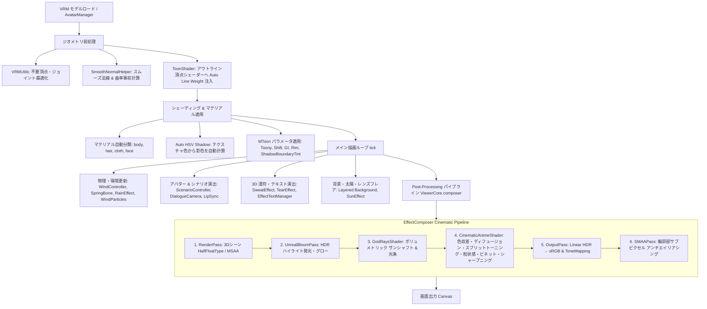

# AnimeVRM (VRM Toon Viewer & Cinematic Engine)

アニメ・セル調表現とシネマティックな映像演出を追求した WebGL / Three.js ベースの次世代 VRM アバタービューア＆アニメーション演出エンジンです。

🌐 **Live Demo:** [https://uemegu.github.io/AnimeVRM/](https://uemegu.github.io/AnimeVRM/)

---

## 📖 目次

- [✨ 特徴](#-特徴)
- [🚀 クイックスタート](#-クイックスタート)
- [🎨 描画 & 演出パイプライン](#-描画--演出パイプライン)
  - [1. モデルロード & ジオメトリ前処理](#1-モデルロード--ジオメトリ前処理)
  - [2. トゥーンシェーディング & マテリアル処理](#2-トゥーンシェーディング--マテリアル処理)
  - [3. 高品質アウトライン (反転法線押し出し法)](#3-高品質アウトライン-反転法線押し出し法)
  - [4. 環境光・太陽光・大気エフェクト](#4-環境光太陽光大気エフェクト)
  - [5. 風・雨・環境物理パーティクル](#5-風雨環境物理パーティクル)
  - [6. シネマティック ポストプロセス パイプライン](#6-シネマティック-ポストプロセス-パイプライン)
  - [7. 漫符・オノマトペ 3D エフェクト演出](#7-漫符オノマトペ-3d-エフェクト演出)
  - [8. マルチアバター & インタラクティブADVシナリオエンジン](#8-マルチアバター--インタラクティブadvシナリオエンジン)
  - [9. オンデバイス AI チャット & ローカル音声合成 (WebGPU)](#9-オンデバイス-ai-チャット--ローカル音声合成-webgpu)
- [🖥️ 統合スタジオ UI (Unified Studio Panel)](#️-統合スタジオ-ui-unified-studio-panel)
- [⚙️ 設定パラメータ (Configuration)](#️-設定パラメータ-configuration)
  - [マテリアル設定 (`materials`)](#1-マテリアル設定-materialsbody--hair--cloth)
  - [アウトライン設定 (`outline`)](#2-アウトライン設定-outline)
  - [ライティング・太陽・フレア設定 (`lighting`)](#3-ライティング太陽フレア設定-lighting)
  - [環境・多層背景・雨設定 (`environment` / `rain`)](#4-環境多層背景雨設定-environment--rain)
  - [風・パーティクル設定 (`wind`)](#5-風パーティクル設定-wind)
  - [シネマティック ポストプロセス設定 (`postProcessing`)](#6-シネマティック-ポストプロセス設定-postprocessing)
  - [カメラ・リップシンク設定 (`camera` / `lipSync`)](#7-カメラリップシンク設定-camera--lipsync)
- [🎬 シーンプリセット (Scene Presets)](#-シーンプリセット-scene-presets)
- [💾 設定の保存・読み込み (JSON)](#-設定の保存読み込み-json)
- [📁 ディレクトリ構成](#-ディレクトリ構成)
- [🛠️ 技術スタック](#️-技術スタック)

---

## ✨ 特徴

- **セルルックシェーディング (MToon 最適化)**:
  - 肌・髪・衣装の自動マテリアル分類とパラメトリック調整
  - **Auto HSV Shadow**: テクスチャ平均色から肌の血色感（暖色シフト）や髪・衣装の青紫系影色を自動計算
  - 影境界のチーク・発色感（`shadowBoundaryTint`）
  - 顔部分の不要な影落ち・割れを抑制するフェイシャル保護
- **高品質アウトライン (Inverted Hull)**:
  - **Smooth Normal (スムーズ法線)**: 頂点法線のハードエッジによる輪郭線破綻を解消
  - **Screen-Space Width**: カメラ距離に依存しない一定の輪郭線幅
  - **Auto Line Weight**: 視線角度（シルエット）に応じた線の抑揚自動補正
  - テクスチャ色に応じた自動輪郭線カラー（色相維持＋暗度・彩度調整）
- **太陽光・レンズフレア・大気エフェクト**:
  - **God Rays (Sun Shafts)**: スクリーン空間でのボリュメトリックな光条・木漏れ日・シマー（陽炎・空気の揺らぎ）
  - **アニメ調プロシージャル Lens Flare**: 太陽本体、グロー、スターバースト放射光、アナモルフィック・ストリークフレア、ゴーストリング、ハロー
  - **大気霞み (Far Fog)**: 遠景の地平線・空に合わせたグラデーション空気層
- **多層背景システム (Layered Background & Keying)**:
  - 遠景＋中景（クロマキー/ルミナンスキーイング自動透過プレーン）による奥行き・視差表現
  - OrbitControls のパン操作に応じた中景プレーンのスマート追従
- **風・雨・環境物理 & 花びらパーティクル連動**:
  - **WindController**: 風速・風向（方位角/仰角）・乱流（Turbulence）・突風（Gust）をリアルタイム計算し、VRM SpringBone（揺れもの）の外力へダイナミックに反映
  - **WindParticles**: 風向・風速に合わせて空間をひらひらと舞い踊る花びら・光の粒子
  - **RainEffect**: 雨脚・水滴のフォールオフ・地面の跳ね返りをプロシージャル生成
- **シネマティック ポストプロセス (CinematicAnimeShader)**:
  - 色収差（Chromatic Aberration）、ディフュージョン・ソフトグロー（Diffusion）、スプリットトーニング（Color Grading）、映画調フィルムグレイン（Film Grain）、ビネット（Vignette）、スマート輪郭シャープニング（Smart Sharpening）
  - UnrealBloom、トーンマッピング、MSAA / SMAA アンチエイリアシング
- **漫画調・漫符 & 3D オノマトペ エフェクト**:
  - **汗・冷や汗エフェクト (`SweatEffect`)**: 4方向飛び散りバースト（`fly4`）およびこめかみ垂れ下がり（`jito`）
  - **涙エフェクト (`TearEffect`)**: 目元から流れるアニメ調の涙演出
  - **3D オノマトペ テキスト (`EffectTextManager`)**: 「ワナワナ」「ドキドキ」「キラキラ」「ガーン」等の漫画文字を空間上にポップ＆ストリーム放出
  - **瞳発光エフェクト (`eyeGlow`)**: 感情に応じた瞳のルミナンス強調
- **マルチアバター & インタラクティブ会話ADVシナリオ**:
  - 複数アバターの同時配置・掛け合い対話（例: 「放課後の寄り道〜アオイとエミリ〜」）
  - プレイヤー選択肢付きインタラクティブ分岐シナリオ（例: 「夕暮れの公園と放課後の期待」）
  - 発話者にフォーカスするダイアログカメラ演出（グイン/スムーズなカメラワーク補間）
  - Meyda 音声解析による高精度リアルタイムリップシンク
- **オンデバイス AI 対話 & ブラウザ内音声合成 (WebGPU / WASM)**:
  - **Gemini Nano (Window AI)**: Chrome 組み込み AI による完全ローカル対話生成
  - **Irodori-TTS (ONNX Runtime Web)**: ブラウザ内 WebGPU/WASM で動作する高速・高品質な日本語音声合成
  - 会話内容に応じた表情・モーションの自動推論＆切り替え
- **リアルタイム カラーヒストグラム解析**:
  - 描画フレームから RGB カラー分布・波形をリアルタイム計測・可視化
- **完全日英バイリンガル対応 (i18n)**:
  - 日本語 / English をワンクリックでシームレス切り替え

---

## 🚀 クイックスタート

### 動作環境
- **推奨ブラウザ**: Google Chrome 最新版（WebGPU / Gemini Nano 対応環境推奨）
- **Node.js**: v18.0 以上

```bash
# 依存パッケージのインストール
npm install

# 開発サーバー起動
npm run dev

# プロダクションビルド
npm run build

# ビルド成果物のプレビュー
npm run preview
```

---

## 🎨 描画 & 演出パイプライン

AnimeVRM では、ジオメトリ前処理、シェーディング、環境物理、マルチアバター演出、そして多層ポストプロセスまで一貫したパイプラインで描画を行います。



### 1. モデルロード & ジオメトリ前処理
- **ロードと最適化 (`Avatar.ts` / `AvatarManager.ts`)**:
  `@pixiv/three-vrm` の `VRMLoaderPlugin` を用いてロードし、`VRMUtils.removeUnnecessaryVertices` / `removeUnnecessaryJoints` で負荷を最適化。
- **スムーズ法線の事前計算 (`SmoothNormalHelper.ts`)**:
  モデルのハードエッジ（法線の不連続面）による裏面押し出し輪郭線の裂けを解消するため、空間ハッシュマップを用いて同座標頂点の平均法線（`smoothNormal`）と曲率（`curvature`）をロード時に事前計算。
- **Auto Line Weight 注入 (`ToonShader.ts`)**:
  MToon アウトラインマテリアルの `onBeforeCompile` をフックし、視線角度ベクトルとの内積（`dotNV`）に応じた線の抑揚コードを頂点シェーダーへ注入。

### 2. トゥーンシェーディング & マテリアル処理
- **パーツ自動分類**:
  メッシュ名・マテリアル名の正規表現から `body`（体・肌）、`hair`（髪）、`cloth`（衣装）、`face`（顔）に自動分類。
- **Auto HSV Shadow (自動影色計算)**:
  マテリアルテクスチャのピクセル平均色を抽出し、HSL 色空間で最適な影色を自動算出。
  - **肌・顔**: 暖色（ピーチ〜赤系）へシフトし、血色感のある影色を生成。影境界のチーク感（`shadowBoundaryTint`）も付加。
  - **髪・衣装**: 彩度を高めつつクールな青紫系へシフトさせ、アニメ調の鮮やかな陰影を生成。
- **フェイシャル保護**:
  顔パーツ（`face`）に対しては、不自然な影割れを防ぐため `shadingShiftFactor` の下限制限やリムライト発光の抑制を実施。

### 3. 高品質アウトライン (反転法線押し出し法)
- MToon 標準の裏面押し出し方式（Inverted Hull）にスムーズ法線を適用。
- `outlineWidthMode = 'screenCoordinates'` により、カメラ距離に左右されない安定した線幅を維持。
- テクスチャ平均色から明度を下げ彩度を微調整したアウトラインカラー（`getDarkenedOutlineColor`）を自動適用。

### 4. 環境光・太陽光・大気エフェクト
- **多層背景 (`ViewerCore.ts`)**: 遠景画像に大気霞み（Far Fog）をブレンド。中景画像は自動ルミナンスキーイングで白背景を透過し、カメラ操作に追従するビルボードプレーンとして描画。
- **サンシャフト・ゴッドレイ (`GodRaysShader.ts`)**: 太陽位置から放射状にスクリーンサンプリングを行い、光条とシマー（揺らぎ）を付加。
- **レンズフレア (`SunEffect.ts`)**: 太陽光源軸上に、アナモルフィックフレア、ゴーストリング、スターバースト光、ハローをプロシージャル描画。

### 5. 風・雨・環境物理パーティクル
- **風コントローラー (`WindController.ts`)**:
  ベース風速・風向、パーリンノイズ風の乱流（Turbulence）、突風（Gust）を重ね合わせた 3D ベクトルを毎フレーム計算。VRM の `SpringBone` 外力に注入。
- **風パーティクル (`WindParticles.ts`)**:
  風向と風速に同期して舞う花びらや光の粒子を Instanced/Points で描画。
- **雨エフェクト (`RainEffect.ts`)**:
  降雨の密度・落下速度・風連動スプラッシュをプロシージャル制御。

### 6. シネマティック ポストプロセス パイプライン
`EffectComposer`（レンダーターゲット: `HalfFloatType`, `MSAA: 4`）上で以下の順にパスを実行します。

| 順序 | パス名 | 役割・処理内容 |
| :--- | :--- | :--- |
| **1** | `RenderPass` | 背景・中景・床・VRM モデル・パーティクル・3D エフェクトを描画 |
| **2** | `UnrealBloomPass` | 高輝度部分を抽出・ぼかし、ふんわりとした光の溢れ（グロー）を付加 |
| **3** | `GodRaysShader` | 太陽光源を中心としたボリュメトリックな光条（サンシャフト）を描画 |
| **4** | `CinematicAnimeShader` | **色収差**、**ディフュージョン（ソフトグロー）**、**カラーグレーディング（スプリットトーニング＋S字カーブ）**、**彩度・明度・コントラスト**、**フィルムグレイン（粒状感）**、**ビネット**、**スマート輪郭シャープニング** を 1 パスで高品質統合処理 |
| **5** | `OutputPass` | Linear HDR 色空間から sRGB への変換およびトーンマッピング（ACESFilmic / AgX / Reinhard / Linear 等）の適用 |
| **6** | `SMAAPass` | 最終画像のエッジに対してサブピクセル アンチエイリアシングを適用 |

### 7. 漫符・オノマトペ 3D エフェクト演出
- **漫符・汗エフェクト (`SweatEffect.ts`)**:
  - `fly4`: 驚きや慌てた際に頭上4方向へ放物線状に飛び散る漫符水滴。
  - `jito`: 困惑や焦り時にこめかみ付近からタラーッと垂れ下がる冷や汗。
- **涙エフェクト (`TearEffect.ts`)**:
  - 悲しみや感動時に目元から流れるアニメ調の涙。
- **オノマトペ 3D テキスト (`EffectTextManager.ts`)**:
  - 「ワナワナ」「ドキドキ」「キラキラ」「ガーン」「シーン」「ビクッ」等の漫画文字テクスチャを Canvas 2D で動的生成し、ビルボード Sprite として 3D 空間に配置。ポップアップやストリーム上昇アニメーションを実行。

### 8. マルチアバター & インタラクティブADVシナリオエンジン
- **複数アバター協調制御 (`twoGirlsConversationScenario.ts`)**:
  2体以上のアバター（アオイ・エミリなど）を同時にシーン内に配置し、それぞれの立ち位置・モーション・視線・表情・セリフを完全同期。
- **選択肢分岐シナリオ (`parkConfessionScenario.ts`)**:
  夕暮れの公園での告白イベントなど、プレイヤーの選択肢によって展開やセリフ・エンディングが分岐。
- **ダイアログカメラ (`DialogueCameraController.ts`)**:
  話者に合わせたバストアップ・クローズアップ・引き・回り込み（Orbit）カメラワークを滑らかに補間遷移。

### 9. オンデバイス AI チャット & ローカル音声合成 (WebGPU)
- **Gemini Nano (`GeminiNanoService.ts`)**:
  Chrome 組み込みの `window.ai` を用い、クラウド通信不要でアバターとリアルタイム日本語対話。セリフから感情表情やジェスチャーモーションを推論。
- **Irodori-TTS (`IrodoriTTSService.ts`)**:
  ONNX Runtime Web と WebGPU / WASM を活用し、ブラウザ内で日本語音声合成を高速実行。Meyda スペクトル解析と連携してリアルタイムに口パク（リップシンク）同期。

---

## 🖥️ 統合スタジオ UI (Unified Studio Panel)

画面右上の歯車ボタン（⚙️）から開閉可能なプロ仕様のダークテーマ統合パネルです。4 つのタブで構成されています。

```
[👤 キャラクター]   [🎪 ステージ]   [🎨 ビジュアル]   [⚙️ システム]
```

1. **👤 キャラクター (Character)**:
   - **モデル切り替え**: サンプルモデル（`girl.vrm`, `girl2.vrm`, `girl3.vrm`）またはローカルの VRM ファイル読み込み
   - **モーション**: 待機、歩行、挨拶、お辞儀、ダンス等の再生＆ループ設定
   - **表情・感情**: 喜怒哀楽、ウインク等のモーフコントロール
   - **漫符・演出エフェクト**: 汗（飛び散り/冷や汗）、涙、オノマトペテキスト（ドキドキ、キラキラ等）、瞳発光
   - **AI 会話モード**: Gemini Nano + Irodori-TTS によるローカル対話
2. **🎪 ステージ (Stage)**:
   - **シーンプリセット**: 公園・校門・教室 × 朝・昼・夕・雨のワンクリック切り替え
   - **背景・中景設定**: 遠景画像、ルミナンスキーイング透過中景、床面グリッド
   - **環境・天候**: 風速・風向・乱流・突風・花びらパーティクル、雨エフェクト
   - **ADV シナリオ**: 公園告白シナリオ（分岐あり）、2人女子会話シナリオの再生・一時停止・シーク
3. **🎨 ビジュアル (Visual)**:
   - **ライティング**: 主光源、環境光、リムライト、深度リム
   - **太陽 & 大気**: サンシャフト（God Rays）、プロシージャルレンズフレア、大気霞み
   - **トゥーンマテリアル**: 肌・髪・衣装のセル境界、影色シフト、影境界チーク
   - **アウトライン**: スムーズ法線、画面空間幅、Auto Line Weight
   - **シネマティック ポストプロセス**: 色収差、ディフュージョン、カラーグレーディング、フィルムグレイン、ビネット、シャープニング、ブルーム、トーンマッピング、アンチエイリアシング
   - **カラーヒストグラム**: リアルタイム RGB 分布・波形モニター
4. **⚙️ システム (System)**:
   - **設定 JSON 管理**: クリップボードへコピー、ファイル保存、JSON 読み込み
   - **リセット**: 初期設定へのワンクリック復元
   - **言語切り替え**: 🇯🇵 日本語 / 🇺🇸 English
   - **パフォーマンス**: FPS / DrawCalls / Triangles モニター

---

## ⚙️ 設定パラメータ (Configuration)

設定は `src/Config.ts` の `AvatarConfig` インターフェースで一元管理されています。

### 1. マテリアル設定 (`materials.body` / `hair` / `cloth`)

| パラメータ名 | 型 | デフォルト (body) | 説明 |
| :--- | :--- | :--- | :--- |
| `color` | `string` | `#fff6f0` | 基本色・血色感（Base Color / Tint） |
| `matcapEnabled` | `boolean` | `true` | ハイライト (MatCap / スフィアマップ) の表示 ON/OFF |
| `emissiveIntensity` | `number` | `0.0` | 自己発光（エミッシブ）強度 |
| `shadowHueShift` | `number` | `0.02` | 影色の色相シフト量（正: 暖色寄り, 負: 寒色寄り） |
| `shadowLightnessFactor` | `number` | `0.16` | 影色の明度比率（低いほど影が濃くなる） |
| `shadowBoundaryTint` | `number` | `0.35` | 明暗境界のチーク・発色強度 |
| `shadingToonyFactor` | `number` | `1.0` | トゥーンの硬さ（`1.0` で完全なセル調2値境界） |
| `shadingShiftFactor` | `number` | `-0.05` | 明暗境界の位置オフセット |
| `giEqualizationFactor` | `number` | `0.9` | 環境光の均一化率（アニメ調のフラットさを向上） |
| `rimEnabled` | `boolean` | `true` | パラメトリックリムライトの有効/無効 |
| `rimColor` | `string` | `#ffffff` | リムライトの発光色 |
| `parametricRimFresnelPowerFactor` | `number` | `5.0` | リムの急峻度（高いほどシルエットの端だけに絞られる） |
| `parametricRimLiftFactor` | `number` | `0.1` | リム光の持ち上げ量 |
| `rimLightingMixFactor` | `number` | `0.1` | 光源方向によるリムの変調比率 |
| `outlineWidthFactor` | `number` | `0.001` | 個別のアウトライン太さ係数 |

### 2. アウトライン設定 (`outline`)

| パラメータ名 | 型 | デフォルト | 説明 |
| :--- | :--- | :--- | :--- |
| `enabled` | `boolean` | `true` | アウトライン（輪郭線）の表示 ON/OFF |
| `useSmoothNormal` | `boolean` | `true` | スムーズ法線による線の裂け防止 |
| `screenSpaceWidth` | `boolean` | `true` | 画面空間固定幅（距離による線幅減衰の防止） |
| `autoLineWeight` | `boolean` | `true` | 視線角度・法線向きによる線の抑揚自動調整 |
| `darknessFactor` | `number` | `0.1` | 輪郭線の暗さ係数（ベース色からの暗度） |
| `widthFactor` | `number` | `0.001` | 輪郭線の太さ基準値 |
| `lightingMixFactor` | `number` | `0.0` | ライティングによる輪郭線色の変化度合い |

### 3. ライティング・太陽・フレア設定 (`lighting`)

| パラメータ名 | 型 | デフォルト | 説明 |
| :--- | :--- | :--- | :--- |
| `castShadows` | `boolean` | `false` | シャドウマップによる落ち影の有無 |
| `ambient.color` / `intensity` | `string` / `number` | `#3e407a` / `0.5` | 環境光の色と強度 |
| `directional.color` / `intensity` | `string` / `number` | `#fffbf0` / `1.8` | 主光源の色と強度 |
| `directional.posX / Y / Z` | `number` | `-3.7 / 0.8 / 0.7` | 主光源の 3D 位置 |
| `rim.enabled` / `color` / `intensity` | `boolean` / `string` / `number` | `true` / `#ffaa60` / `0.3` | 補助環境リム光 |
| `depthRim.enabled` / `power` / `intensity` | `boolean` / `number` / `number` | `true` / `3.5` / `1.0` | 深度リムライト効果 |
| `sunShafts.enabled` / `color` / `exposure` | `boolean` / `string` / `number` | `true` / `#ff7826` / `0.36` | 太陽光条（God Rays） |
| `sunShafts.decay` / `density` / `weight` | `number` | `0.83 / 0.5 / 0.48` | サンシャフトの減衰・密度・重み |
| `sunShafts.shimmer` | `number` | `0.25` | サンシャフトの陽炎・揺らぎ強度 |
| `lensFlare.enabled` / `sunColor` / `sunSize` | `boolean` / `string` / `number` | `true` / `#ff6222` / `1.05` | アニメ調レンズフレア |
| `lensFlare.glowIntensity` / `starburstIntensity` | `number` | `1.15 / 1.05` | グロー / 放射光強度 |
| `lensFlare.anamorphicIntensity` / `ghostIntensity` | `number` | `0.95 / 0.95` | 横長ストリーク光 / ゴースト強度 |
| `lensFlare.haloIntensity` | `number` | `0.8` | ハロー環強度 |

### 4. 環境・多層背景・雨設定 (`environment` / `rain`)

| パラメータ名 | 型 | デフォルト | 説明 |
| :--- | :--- | :--- | :--- |
| `showBackgroundImage` | `boolean` | `true` | 背景画像の表示 ON/OFF |
| `backgroundImageUrl` | `string` | `/textures/modern-park-far.jpg` | 遠景画像の URL / パス |
| `showMidground` | `boolean` | `true` | 中景レイヤー（自動透過）の表示 ON/OFF |
| `midgroundImageUrl` | `string` | `/textures/modern-park-mid.jpg` | 中景画像の URL / パス |
| `farFogEnabled` / `farFogColor` / `farFogIntensity` | `boolean` / `string` / `number` | `true` / `#ff7e4d` / `0.08` | 遠景の大気霞み（フォグ）設定 |
| `rain.enabled` / `density` / `speed` | `boolean` / `number` / `number` | `false` / `1200` / `1.0` | 雨エフェクトの有効化・密度・落下速度 |
| `rain.splashEnabled` / `angle` | `boolean` / `number` | `true` / `0.0` | 地面水しぶき有効化・降雨傾き角度 |

### 5. 風・パーティクル設定 (`wind`)

| パラメータ名 | 型 | デフォルト | 説明 |
| :--- | :--- | :--- | :--- |
| `enabled` | `boolean` | `true` | 風物理演算の有効化 |
| `speed` | `number` | `0.1` | 基準風速 |
| `direction` / `elevation` | `number` / `number` | `45` (deg) / `5` (deg) | 風向（水平方位角 / 垂直仰角） |
| `turbulence` / `gustFrequency` / `gustStrength` | `number` | `0.15 / 0.2 / 0.15` | 乱流・突風の頻度と強さ |
| `particles.enabled` / `count` | `boolean` / `number` | `true / 160` | 風連動パーティクル表示・個数 |
| `particles.color` / `size` / `speedFactor` | `string` / `number` / `number` | `#e2f8ff / 0.035 / 1.0` | パーティクル色・サイズ・速度倍率 |

### 6. シネマティック ポストプロセス設定 (`postProcessing`)

| パラメータ名 | 型 | デフォルト | 説明 |
| :--- | :--- | :--- | :--- |
| `toneMappingMode` | `string` | `'None'` | トーンマッピング (`'ACESFilmic'`, `'AgX'`, `'Reinhard'`, `'Linear'`, `'None'`) |
| `antialiasing.msaaSamples` / `smaa` | `number` / `boolean` | `4 / true` | MSAA サンプリング数 (0, 2, 4, 8) / SMAA 有効化 |
| `bloom.enabled` / `strength` / `radius` | `boolean` / `number` / `number` | `true / 0.15 / 0.22` | UnrealBloom 設定 |
| `colorGrading.enabled` | `boolean` | `true` | スプリットトーニング・カラーグレーディング有効化 |
| `colorGrading.shadowTint` / `highlightTint` | `string` | `#391752 / #ffad70` | 影（暗部）と明部（ハイライト）のティントカラー |
| `colorGrading.strength` / `contrast` / `gamma` | `number` | `0.65 / 0.18 / 0.95` | ブレンド強度・S字コントラスト・ガンマ |
| `cinematic.chromaticAberration.enabled / offset` | `boolean` / `number` | `true / 0.0015` | 色収差の有効化・オフセット量 |
| `cinematic.diffusion.enabled / strength / radius`| `boolean` / `number` / `number` | `true / 0.24 / 1.8` | ディフュージョン（ソフトグロー）設定 |
| `cinematic.filmGrain.enabled / strength / speed` | `boolean` / `number` / `number` | `true / 0.035 / 1.0` | 映画調フィルムグレイン設定 |
| `cinematic.vignette.enabled / darkness / offset` | `boolean` / `number` | `true / 0.35 / 1.1` | 周辺減光（ビネット）設定 |
| `cinematic.sharpening.enabled / amount` | `boolean` / `number` | `true / 0.22` | スマート輪郭シャープニング設定 |

### 7. カメラ・リップシンク設定 (`camera` / `lipSync`)

- **`camera`**: 初期画角 (`fov: 30`), カメラ位置 (`x, y, z`), ターゲット位置, ズーム範囲 (`minDistance: 0.5`, `maxDistance: 10`)
- **`lipSync`**: 音声リップシンクゲイン (`gain: 0.65`), 追従スムージング (`smoothing: 0.17`), 判定閾値 (`rmsThreshold: 0.008`), 音声遅延補正 (`audioDelay: 0.05`), 声質 (`voiceGender: 'female' | 'male'`)

---

## 🎬 シーンプリセット (Scene Presets)

時間帯（Time of Day）とロケーション（Location）の組み合わせで、ライティング・ポストプロセス・大気・風・雨を一括最適化します。

### 📊 主なプリセット比較

| プリセットID | ロケーション | 時間帯 / 天候 | 背景 | 主光源 (Dir Light) | サンシャフト / フレア | ポストプロセス特徴 | 特殊効果 |
| :--- | :--- | :--- | :--- | :--- | :--- | :--- | :--- |
| **`morning_park`** | 近代公園 | 🌅 朝 (Morning) | 近代公園 (2層) | `#ffffff` / `2.6` (右上高) | 澄んだ朝陽 (白黄) | コントラスト高・爽快 | 花びら舞い |
| **`day_park`** | 近代公園 | ☀️ 昼 (Day) | 近代公園 (2層) | `#ffffff` / `2.6` (左斜め前) | 昼の自然光サンシャフト・フレア | 高彩度・ニュートラル | 花びら舞い |
| **`evening_park`** | 近代公園 | 🌇 夕方 (Evening) | 近代公園 (2層) | `#fffbf0` / `1.8` (左低) | 茜色の夕陽・大型フレア | スプリットトーニング (紫/橙) | 花びら舞い |
| **`rainy_park`** | 近代公園 | 🌧️ 雨 (Rainy) | 近代公園 (2層) | `#b0c4de` / `1.2` (薄曇) | OFF | 落ち着いた彩度・冷色 | **雨・水滴エフェクト** |
| **`morning_school`** | 校門前 | 🌅 朝 (Morning) | 校門前 (単層) | `#ffffff` / `2.6` (右上高) | 澄んだ朝陽 (白黄) | コントラスト高・爽快 | 花びら舞い |
| **`evening_school`** | 校門前 | 🌇 夕方 (Evening) | 校門前 (単層) | `#fffbf0` / `1.8` (左低) | 茜色の夕陽・大型フレア | スプリットトーニング (紫/橙) | 花びら舞い |
| **`bright_indoor`** | 教室 | 💡 室内 (Bright) | 教室廊下 (単層) | `#ffffff` / `2.2` (窓光) | OFF | フラット・クリア | 風・雨 OFF |
| **`dark_indoor`** | 教室 | 🌙 夜間 (Dark) | 教室廊下 (単層) | `#b7cdf0` / `2.5` (月光) | 月光サンシャフト | 影に夜闇・冷光 | **髪ハイライト自動消灯** |

---

## 💾 設定の保存・読み込み (JSON)

設定パネルの「システム」タブまたはショートカットからいつでも設定状態を管理できます。

- **📋 設定JSONをコピー**: 現在の全パラメータ設定をクリップボードに JSON 文字列としてコピー
- **💾 JSONファイル保存**: `avatar-config.json` としてローカルにダウンロード
- **📥 JSONを読み込み**: 保存した JSON を貼り付けて即座に全パラメータへ反映
- **🔄 デフォルトにリセット**: 初期プリセット設定へ復元

---

## 📁 ディレクトリ構成

```text
vrm-genshin-like/
├── public/
│   ├── animations/        # 待機・歩行・挨拶・ダンス等の Mixamo FBX アニメーション
│   ├── bgm/               # シナリオ用 BGM (bgm.mp3 等)
│   ├── models/            # サンプル VRM モデル (girl.vrm, girl2.vrm, girl3.vrm)
│   ├── se/                # 環境音・UI効果音 (蝉の声、決定音、選択ホバー音 等)
│   ├── textures/          # 背景・中景テクスチャ画像 (公園・学校・教室)
│   └── voices/            # シナリオ会話・リップシンク用音声ファイル
├── src/
│   ├── ai/                # オンデバイス AI 対話 & ローカル音声合成
│   │   ├── AvatarChatController.ts  # 対話制御・モーション/表情推論
│   │   ├── GeminiNanoService.ts     # Chrome 組み込み Gemini Nano (window.ai) 連携
│   │   ├── IrodoriTTSService.ts     # ブラウザ内 Irodori-TTS 音声合成サービス
│   │   └── irodori/pipeline.ts      # ONNX Runtime Web / WebGPU 推論パイプライン
│   ├── animation/         # 演出プレイヤー & UI
│   │   ├── AdventureMessageWindow.ts# 選択肢付きタイプライター風メッセージウィンドウ
│   │   ├── ScenarioPlayer.ts        # 旧シナリオプレイヤー
│   │   ├── ShortAnimationPlayer.ts  # ショート演出再生
│   │   └── TypographyOverlay.ts     # 前後タイポグラフィ文字演出
│   ├── avatar/            # アバター管理
│   │   └── AvatarManager.ts         # VRM ロード、マルチアバター同時配置、モーション制御
│   ├── effects/           # 漫画調漫符・環境エフェクト
│   │   ├── rain/RainEffect.ts       # 雨天・水滴・地面スプラッシュエフェクト
│   │   ├── sweat/SweatEffect.ts     # 汗・冷や汗エフェクト (fly4 / jito)
│   │   ├── tears/TearEffect.ts      # 涙エフェクト
│   │   └── text/EffectTextManager.ts# 3D 空間オノマトペ・漫符テキスト
│   ├── histogram/         # カラーヒストグラム
│   │   └── ColorHistogram.ts        # リアルタイム RGB 分布・波形解析
│   ├── i18n/              # 国際化 (多言語対応)
│   │   ├── locales/ja.ts            # 日本語辞書
│   │   ├── locales/en.ts            # 英語辞書
│   │   └── index.ts                 # 言語切り替え・翻訳ヘルパー
│   ├── postprocessing/    # ポストプロセス シェーダー
│   │   ├── CinematicAnimeShader.ts  # 色収差・ディフュージョン・トーニング・粒状感・ビネット・シャープ
│   │   ├── GodRaysShader.ts         # ボリュメトリック光条 (God Rays)
│   │   └── SunEffect.ts             # アニメ調プロシージャル レンズフレア
│   ├── presets/           # シーンプリセット定義
│   │   └── ScenePresets.ts          # 時間帯 × ロケーション プリセット
│   ├── scenario/          # ADVシナリオエンジン
│   │   ├── DialogueCameraController.ts # ダイアログカメラワーク自動制御
│   │   ├── ScenarioEngine.ts        # 選択肢分岐対応 シナリオ実行エンジン
│   │   ├── ScenarioController.ts    # シナリオ再生・ステージ連動コントローラー
│   │   ├── parkConfessionScenario.ts# 公園告白シナリオ（分岐付き）
│   │   └── twoGirlsConversationScenario.ts # 2人女子掛け合いシナリオ
│   ├── scene/             # Three.js コア・シーン管理
│   │   ├── ScenePresetManager.ts    # プリセット切り替えマネージャー
│   │   └── ViewerCore.ts            # シーン、カメラ、レンダラー、Composer 統合
│   ├── shader/            # シェーダー補助
│   │   └── SmoothNormalHelper.ts    # スムーズ法線・曲率事前計算
│   ├── ui/                # 統合スタジオ UI
│   │   ├── inspector/               # 各種インスペクター (Visual, Stage, Manager)
│   │   ├── components/              # モーダル、トースト
│   │   └── UnifiedPanel.ts          # 4タブ構成 統合スタジオパネル
│   ├── wind/              # 風物理シミュレーション
│   │   ├── WindController.ts        # 風速・風向・乱流・突風計算 & SpringBone 連動
│   │   └── WindParticles.ts         # 風連動パーティクル演出
│   ├── AudioLipSync.ts    # Meyda スペクトル解析 & リアルタイムリップシンク
│   ├── Avatar.ts          # 個別 VRM アバターの描画・マテリアル・アニメーション
│   ├── Config.ts          # 全設定パラメータの型定義・デフォルト値・JSON入出力
│   ├── ToonShader.ts      # MToon パラメータ制御・Auto HSV 影色計算・アウトライン制御
│   ├── main.ts            # アプリケーション初期化・エントリポイント
│   └── style.css          # UI スタイルシート
├── index.html
├── package.json
└── vite.config.ts
```

---

## 🛠️ 技術スタック

- **3D Engine**: [Three.js](https://threejs.org/) (r183)
- **VRM Support**: [@pixiv/three-vrm](https://github.com/pixiv/three-vrm) (v3.5)
- **On-Device AI**: Gemini Nano (Window AI / Chrome Built-in AI)
- **Local Neural TTS**: [Irodori-TTS](https://github.com/huggingface/transformers) via [ONNX Runtime Web](https://onnxruntime.ai/) (WebGPU / WASM)
- **Audio Analysis**: [Meyda](https://meyda.js.org/) (Realtime Audio Feature Extraction for Lip-Sync)
- **Bundler & Tooling**: [Vite](https://vitejs.dev/), TypeScript