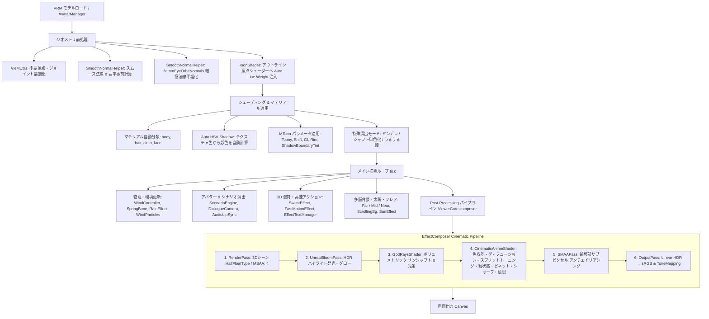

# AnimeVRM (VRM Toon Viewer & Cinematic Engine)

アニメ・セル調表現とシネマティックな映像演出を追求した WebGL / Three.js ベースの次世代 VRM アバタービューア＆アニメーション演出エンジンです。

🌐 **Live Demos & Tools:**
- **メインビューア (Main Viewer):** [https://uemegu.github.io/AnimeVRM/](https://uemegu.github.io/AnimeVRM/)
- **モーションミキサー (Motion Mixer):** [https://uemegu.github.io/AnimeVRM/motion.html](https://uemegu.github.io/AnimeVRM/motion.html)
- **リップシンクアナライザー (LipSync Analyzer):** [https://uemegu.github.io/AnimeVRM/lipsync.html](https://uemegu.github.io/AnimeVRM/lipsync.html)
- **シャフト風演出シナリオ「幽霊の質量」:** [https://uemegu.github.io/AnimeVRM/scenarios/ghost-mass.html](https://uemegu.github.io/AnimeVRM/scenarios/ghost-mass.html)
- **オリジナル短編PV「5秒の告白」:** [https://uemegu.github.io/AnimeVRM/scenarios/five-seconds-pv.html](https://uemegu.github.io/AnimeVRM/scenarios/five-seconds-pv.html)

---

## 📖 目次

- [✨ 特徴](#-特徴)
- [🚀 クイックスタート](#-クイックスタート)
- [🎨 描画 & 演出パイプライン](#-描画--演出パイプライン)
  - [1. モデルロード & ジオメトリ前処理](#1-モデルロード--ジオメトリ前処理)
  - [2. トゥーンシェーディング & マテリアル処理](#2-トゥーンシェーディング--マテリアル処理)
  - [3. 高品質アウトライン (反転法線押し出し法)](#3-高品質アウトライン-反転法線押し出し法)
  - [4. 多層背景システム & スクロール・パノラマ・プロシージャル空](#4-多層背景システム--スクロールパノラマプロシージャル空)
  - [5. 環境光・太陽光・大気エフェクト](#5-環境光太陽光大気エフェクト)
  - [6. 風・雨・環境物理パーティクル](#6-風雨環境物理パーティクル)
  - [7. シネマティック ポストプロセス パイプライン](#7-シネマティック-ポストプロセス-パイプライン)
  - [8. 漫符・オノマトペ 3D & ウルウル瞳エフェクト](#8-漫符オノマトペ-3d--ウルウル瞳エフェクト)
  - [9. ヤンデレ闇落ちモード (Yandere Mode)](#9-ヤンデレ闇落ちモード-yandere-mode)
  - [10. シャフト風演出モード (Shaft Mode & Cut-in)](#10-シャフト風演出モード-shaft-mode--cut-in)
  - [11. アニメ高速アクション演出 (Fast Motion & Limb Effects)](#11-アニメ高速アクション演出-fast-motion--limb-effects)
  - [12. 14種類の多彩なインタラクティブADVシナリオエンジン](#12-14種類の多彩なインタラクティブadvシナリオエンジン)
  - [13. Gemini Multimodal Live API リアルタイム双方向音声対話](#13-gemini-multimodal-live-api-リアルタイム双方向音声対話)
- [🎛️ 付属スタジオ & 開発ツール](#️-付属スタジオ--開発ツール)
  - [Motion Mixer (`motion.html`)](#motion-mixer-motionhtml)
  - [LipSync Analyzer (`lipsync.html`)](#lipsync-analyzer-lipsynchtml)
  - [Eye Atelier (`tools/eye-editor/`)](#eye-atelier-toolseye-editor)
- [🖥️ 統合スタジオ UI (Unified Studio Panel)](#️-統合スタジオ-ui-unified-studio-panel)
- [⚙️ 設定パラメータ (Configuration)](#️-設定パラメータ-configuration)
  - [マテリアル設定 (`materials`)](#1-マテリアル設定-materialsbody--hair--cloth)
  - [アウトライン設定 (`outline`)](#2-アウトライン設定-outline)
  - [ライティング・太陽・フレア設定 (`lighting`)](#3-ライティング太陽フレア設定-lighting)
  - [環境・多層背景・雨設定 (`environment` / `rain`)](#4-環境多層背景雨設定-environment--rain)
  - [風・パーティクル設定 (`wind`)](#5-風パーティクル設定-wind)
  - [シネマティック ポストプロセス設定 (`postProcessing`)](#6-シネマティック-ポストプロセス設定-postprocessing)
  - [カメラ・リップシンク・その他設定](#7-カメラリップシンクその他設定)
- [🎬 シーンプリセット (Scene Presets)](#-シーンプリセット-scene-presets)
- [👤 キャラクターアバター構成](#-キャラクターアバター構成)
- [🖼️ 画像アセット標準化ガイドライン (AVIF)](#️-画像アセット標準化ガイドライン-avif)
- [💾 設定の保存・読み込み (JSON)](#-設定の保存読み込み-json)
- [📁 ディレクトリ構成](#-ディレクトリ構成)
- [🛠️ 技術スタック](#️-技術スタック)

---

## ✨ 特徴

- **セルルックシェーディング (MToon 最適化)**:
  - 肌・髪・衣装の自動マテリアル分類とパラメトリック調整
  - **Auto HSV Shadow**: テクスチャ平均色から肌の血色感（暖色シフト）や髪・衣装の青紫系影色を自動計算
  - 影境界のチーク・発色感（`shadowBoundaryTint`）
  - **眼窩法線平坦化 (`flattenEyeOrbitNormals`)**: 目頭・眼窩周辺の法線を前向きへブレンド補正し、アニメ調のすっきりした目元と不要な影落ち・黒ずみ防止を実現
  - 顔部分の不要な影落ち・割れを抑制するフェイシャル保護（`faceShadingShiftFactor`）
  - 足元のグラデーション影・空気感演出（`bottomGradient`）
- **高品質アウトライン (Inverted Hull)**:
  - **Smooth Normal (スムーズ法線)**: 頂点法線のハードエッジによる輪郭線破綻を解消
  - **Screen-Space Width**: カメラ距離に依存しない一定の輪郭線幅
  - **Auto Line Weight**: 視線角度（シルエット）に応じた線の抑揚自動補正
  - テクスチャ色に応じた自動輪郭線カラー（色相維持＋暗度・彩度調整）
- **多層背景システム & スクロール・パノラマ・プロシージャル空**:
  - **遠景 (Far Background)**: `scene.background` に設定される広域背景＋大気霞み（Far Fog）
  - **中景 (Midground)**: アバターより奥（`renderOrder = -1`）に配置される透過環境プレーン（公園の樹木など）
  - **近景 (Nearground)**: アバターより手前（`renderOrder = 2`）に配置される前景オブジェクト（カフェのテーブルなど）。アバターを挟み込むことでリアルな空間深度を表現
  - **横スクロール背景 (`ScrollingBackgroundManager`)**: 歩行アニメーションと完全連動。すりガラス風被写界深度ブラー、左右フェザー減衰、パララックス移動
  - **360度パノラマ背景 (`PanoramaBackgroundController`)**: ドラッグ操作によるスムーズな全天周視点移動
  - **プロシージャル空背景 (`SkyBackground`) & アニメ夢背景 (`AnimeDreamBackground`)**: 時間帯連動の空グラデーションや回想・内面描写向けの幾何学抽象背景
- **シャフト風演出モード (`ShaftModeController` & `ShaftCutInOverlay`)**:
  - キャラクターの単色シルエット化（赤・黒・緑・白）＋ホワイトアウトライン
  - 巨大縦書き明朝体タイポグラフィによるテキスト演出
  - 象徴的な首かしげ（**シャフ度**）ボーン変形・追従カメラワーク
  - アイキャッチカットイン演出（幾何学分割トランジション）
  - シャフト宇宙ステージ（太陽・公転する地球・取り残される文字）
- **アニメ高速アクション演出 (`FastMotionEffect`)**:
  - **速度トラッカー (`LimbVelocityTracker`)**: 手足ボーンの移動速度をリアルタイム検出
  - **作画風残像 (`LimbAfterimageRenderer`)**: 一定速度を超えた手足の残像半透明メッシュ追従
  - **スピードリボン (`SpeedRibbonMesh`)**: 軌跡に沿って生成されるアニメ風の光条リボン
  - **方向性モーションブラー (`LimbDirectionalBlur`)**: 移動方向に引き伸ばされる残像ブラー
  - **集中線オーバーレイ (`FocusLinesOverlay`)**: 激しいアクション時のスクリーン集中線
- **ヤンデレ闇落ちモード (`Yandere Mode`)**:
  - ハイライト完全消灯（`hideHighlights`）
  - 瞳テクスチャ単色化＆暗褐色濁り（`flatIrisTexture`）
  - 白目トーンダウン（`dimEyeWhite`）
  - 首かしげ傾き演出（`tiltHead`, `tiltAngle`）
  - まばたき抑制（`suppressBlink` で一切瞬きをしない狂気表現）
  - 虚ろな見開き微笑みモーフ直接制御（`Fcl_MTH_Joy`, `Fcl_EYE_Spread`, `Fcl_BRW_Sorrow` 等）
  - ドアスコープ魚眼レンズ視点（`cinematic.fisheye`）ホラーシナリオとの即時連動
- **漫画調漫符・感情エフェクト**:
  - **汗・冷や汗エフェクト (`SweatEffect`)**: 4方向飛び散りバースト（`fly4`）およびこめかみ垂れ下がり（`jito`）
  - **涙エフェクト (`TearEffect`)**: 目元から流れるアニメ調の涙演出
  - **ウルウル瞳エフェクト (`WateryEyeEffect`)**: 水面波紋のゆらめき・下まぶたの涙だまり・光粒きらめき
  - **3D オノマトペ テキスト (`EffectTextManager`)**: 「ワナワナ」「ドキドキ」「キラキラ」「ガーン」「🖤 ずっと一緒…」等の漫画文字を空間上にポップ＆ストリーム放出
  - **瞳発光エフェクト (`eyeGlow`)**: 感情に応じた瞳のルミナンス強調
- **14種類の多彩なインタラクティブ ADV シナリオエンジン**:
  - 全シナリオが独立したURL（`scenarios/*.html`）で直接実行・シェア可能（OGP画像完備）
  - 楽曲完全同期短編PV、ホラー、ラブコメ、新NISA投資、高速アクション特訓、日常会話など多彩なジャンル
  - 発話者にフォーカスするダイアログカメラ演出（`DialogueCameraController`）
  - 選択肢分岐・タイポグラフィ幕間タイトル演出（`PvTitleOverlay`）
- **Gemini Multimodal Live API リアルタイム双方向音声対話**:
  - WebSocket (`BidiGenerateContent`) による超低遅延な双方向音声ストリーミング
  - マイク音声入力（16kHz PCM）＆ Gemini リアルタイム音声出力（24kHz PCM）
  - 会話内容・感情に連動したモーション・表情・カメラの自律ツール呼び出し（Function Calling）
  - 30種類の Gemini 公式プリセットボイス切り替え
- **高精度リアルタイム リップシンク (Meyda + VAD)**:
  - Meyda 音声解析（フォルマント F1/F2、RMS）による高精度な母音（あ・い・う・え・お）口パク追従
  - 女性・男性別プロファイル、VAD（音声区間検出）による口開閉の安定化
- **独立 Web スタジオ & 制作ツール同梱**:
  - **Motion Mixer (`motion.html`)**: ブラウザ上でMixamoモーションをタイムライン合成・部位別ブレンド・接地補正し、FBX 7.4 binaryを書き出し
  - **LipSync Analyzer (`lipsync.html`)**: 音声ファイルやマイクから母音距離・一音判定ミリ秒レイテンシを可視化・検証
  - **Eye Atelier (`tools/eye-editor/`)**: Blender連携でVRoidモデルの目元・アイライン・瞳・眉をWeb UIでミリ単位調整しVRM出力
- **完全日英バイリンガル対応 (i18n)**: 日本語 / English をワンクリックでシームレス切り替え

---

## 🚀 クイックスタート

### 動作環境
- **推奨ブラウザ**: Google Chrome 最新版（WebGPU / WebSocket 音声ストリーミング対応）
- **Node.js**: v18.0 以上

```bash
# 依存パッケージのインストール
npm install

# 開発サーバー起動
npm run dev
```

起動後、ブラウザで以下の URL にアクセスできます：

| 画面 | ローカル URL | 説明 |
| :--- | :--- | :--- |
| **メインビューア** | `http://localhost:5173/AnimeVRM/` | 統合スタジオパネル、3Dシーン、全演出・全シナリオ実行 |
| **Motion Mixer** | `http://localhost:5173/AnimeVRM/motion.html` | モーションタイムライン合成・部位ブレンド・FBX書き出し |
| **LipSync Analyzer** | `http://localhost:5173/AnimeVRM/lipsync.html` | リップシンク性能検証・母音距離解析・レイテンシ測定 |
| **独立シナリオ (例)** | `http://localhost:5173/AnimeVRM/scenarios/ghost-mass.html` | 単独で動作する各ADVシナリオプレイヤー |

### ビルド & プレビュー

```bash
# プロダクションビルド (docs/ ディレクトリに出力)
npm run build

# ビルド成果物のローカルプレビュー
npm run preview

# 背景・テクスチャ画像の AVIF 一括変換
npm run convert:textures
```

### ブラウザ自動検証 (Playwright)

```bash
# ヘッドレス E2E テスト実行
npx playwright test
```

---

## 🎨 描画 & 演出パイプライン

AnimeVRM では、ジオメトリ前処理、シェーディング、多層環境演出、マルチアバター協調、そしてシネマティックポストプロセスまで一貫したパイプラインで描画を行います。



### 1. モデルロード & ジオメトリ前処理
- **ロードと最適化 (`Avatar.ts` / `AvatarManager.ts`)**:
  `@pixiv/three-vrm` の `VRMLoaderPlugin` を用いてロードし、`VRMUtils.removeUnnecessaryVertices` / `removeUnnecessaryJoints` で負荷を最適化。
- **スムーズ法線の事前計算 (`SmoothNormalHelper.ts`)**:
  モデルのハードエッジ（法線の不連続面）による裏面押し出し輪郭線の裂けを解消するため、空間ハッシュマップを用いて同座標頂点の平均法線（`smoothNormal`）と曲率（`curvature`）をロード時に事前計算。
- **眼窩法線の平坦化 (`flattenEyeOrbitNormals`)**:
  目頭・眼窩周辺の法線を前向き（Z方向）へブレンド補正し、アニメキャラクター特有の平坦ですっきりした目元を維持。不要な影落ちや黒ずみを防止。
- **Auto Line Weight 注入 (`ToonShader.ts`)**:
  MToon アウトラインマテリアルの `onBeforeCompile` をフックし、視線角度ベクトルとの内積（`dotNV`）に応じた線の抑揚コードを頂点シェーダーへ注入。

### 2. トゥーンシェーディング & マテリアル処理
- **パーツ自動分類**:
  メッシュ名・マテリアル名の正規表現から `body`（体・肌）、`hair`（髪）、`cloth`（衣装）、`face`（顔）に自動分類。
- **Auto HSV Shadow (自動影色計算)**:
  マテリアルテクスチャのピクセル平均色を抽出し、HSL 色空間で最適な影色を自動算出。
  - **肌・顔**: 暖色（ピーチ〜赤系）へシフトし、血色感のある影色を生成。影境界のチーク感（`shadowBoundaryTint`）も付加。
  - **髪・衣装**: 彩度を高めつつクールな青紫系へシフトさせ、アニメ調の鮮やかな陰影を生成。
- **フェイシャル保護 (`faceShadingShiftFactor`)**:
  顔パーツに対しては、不自然な影割れを防ぐため `shadingShiftFactor` の下限制限やリムライト発光の抑制を実施。
- **ボトムグラデーション (`bottomGradient`)**:
  モデル足元に向けてプロシージャルな減光グラデーションをかけ、地面への接地感と空気遠近法を表現。

### 3. 高品質アウトライン (反転法線押し出し法)
- MToon 標準の裏面押し出し方式（Inverted Hull）にスムーズ法線を適用。
- `outlineWidthMode = 'screenCoordinates'` により、カメラ距離に左右されない安定した線幅を維持。
- テクスチャ平均色から明度を下げ彩度を微調整したアウトラインカラー（`getDarkenedOutlineColor`）を自動適用。

### 4. 多層背景システム & スクロール・パノラマ・プロシージャル空
- **3層構造 (Far / Mid / Near)**:
  - **遠景 (Far Background)**: `scene.background` に設定。大気霞み（Far Fog）とブレンド。
  - **中景 (Midground)**: アバターの背後（`renderOrder = -1`）に配置される環境レイヤー（公園の樹木など）。自動ルミナンスキーイングで白背景を透過。
  - **近景 (Nearground)**: アバターの手前（`renderOrder = 2`）に配置される前景レイヤー（カフェのテーブルなど）。アバターを前後から挟み込むことでリアルな空間深度とシチュエーションを表現。
- **横スクロール背景 (`ScrollingBackgroundManager.ts`)**:
  歩行アニメーションに合わせて背景をスムーズに横スクロール。すりガラス風ノイズブラー（`uBlurAmount`）、エッジ透過フェザー（`uFeatherWidth`）、パララックス・ズーム制御を搭載。
- **360度パノラマ背景 (`PanoramaBackgroundController.ts`)**:
  全天周パノラマ画像を球体/天球上にマッピングし、スムーズなドラッグ操作と自動アイドリング視点移動を提供。
- **プロシージャル空背景 (`SkyBackground.ts`) & 夢背景 (`AnimeDreamBackground.ts`)**:
  時間帯に応じた美しい空のグラデーションや、回想・内面描写用の幾何学パステル背景。

### 5. 環境光・太陽光・大気エフェクト
- **サンシャフト・ゴッドレイ (`GodRaysShader.ts`)**: 太陽位置から放射状にスクリーンサンプリングを行い、光条とシマー（揺らぎ）を付加。
- **レンズフレア (`SunEffect.ts`)**: 太陽光源軸上に、アナモルフィックフレア、ゴーストリング、スターバースト光、ハローをプロシージャル描画。
- **オクルージョンレイキャスター (`OcclusionRaycaster.ts`)**: キャラクターやオブジェクトが太陽を遮った際のフレア減衰を物理的に判定。

### 6. 風・雨・環境物理パーティクル
- **風コントローラー (`WindController.ts`)**:
  ベース風速・風向、乱流（Turbulence）、突風（Gust）を重ね合わせた 3D ベクトルを毎フレーム計算。VRM の `SpringBone` 外力に注入。
- **風パーティクル (`WindParticles.ts`)**:
  風向と風速に同期して舞う花びらや光の粒子を Instanced/Points で描画。
- **雨エフェクト (`RainEffect.ts`)**:
  降雨の密度・落下速度・風連動スプラッシュをプロシージャル制御。

### 7. シネマティック ポストプロセス パイプライン
`EffectComposer`（レンダーターゲット: `HalfFloatType`, `MSAA: 4`）上で以下の順にパスを実行します。

| 順序 | パス名 | 役割・処理内容 |
| :--- | :--- | :--- |
| **1** | `RenderPass` | 背景・近景・中景・床・VRM モデル・パーティクル・3D エフェクトを描画 |
| **2** | `UnrealBloomPass` | 高輝度部分を抽出・ぼかし、ふんわりとした光の溢れ（グロー）を付加 |
| **3** | `GodRaysShader` | 太陽光源を中心としたボリュメトリックな光条（サンシャフト）を描画 |
| **4** | `CinematicAnimeShader` | **色収差**、**ディフュージョン（ソフトグロー）**、**カラーグレーディング（スプリットトーニング＋S字カーブ）**、**彩度・明度・コントラスト**、**フィルムグレイン（粒状感）**、**ビネット**、**スマート輪郭シャープニング**、**魚眼レンズ歪み** を 1 パスで高品質統合処理 |
| **5** | `SMAAPass` | 輪郭部やハイコントラストエッジに対してサブピクセル アンチエイリアシングを適用（Linear 色空間） |
| **6** | `OutputPass` | Linear HDR 色空間から sRGB への変換およびトーンマッピング（ACESFilmic / AgX / Reinhard / Linear 等）の適用 |

### 8. 漫符・オノマトペ 3D & ウルウル瞳エフェクト
- **漫符・汗エフェクト (`SweatEffect.ts`)**:
  - `fly4`: 驚きや慌てた際に頭上4方向へ放物線状に飛び散る漫符水滴。
  - `jito`: 困惑や焦り時にこめかみ付近からタラーッと垂れ下がる冷や汗。
- **涙エフェクト (`TearEffect.ts`)**:
  - 悲しみや感動時に目元から流れるアニメ調の涙。
- **ウルウル瞳エフェクト (`WateryEyeEffect.ts`)**:
  - 瞳表面の水膜シェーダー。波紋のゆらめき、下まぶたの涙だまりハイライト、光粒のきらめきをプロシージャル生成。
- **オノマトペ 3D テキスト (`EffectTextManager.ts`)**:
  - 「ワナワナ」「ドキドキ」「キラキラ」「ガーン」「シーン」「ビクッ」「🖤 ずっと一緒…」等の漫画文字テクスチャを Canvas 2D で動的生成し、ビルボード Sprite として 3D 空間に配置。

### 9. ヤンデレ闇落ちモード (Yandere Mode)
- **ハイライト消灯**: `EyeHighlight` マテリアルの非表示化・発光ゼロ化
- **瞳の濁り・単色化**: 瞳テクスチャを暗褐色（`#3b080f` など）の単色へ切り替え
- **白目トーンダウン**: 白目マテリアルを暗めのグレーへ減光
- **首かしげ演出**: 頭部ボーンを傾斜角（`tiltAngle`）で不気味に傾斜
- **無瞬き**: まばたきアニメーションを完全停止
- **狂気の微笑み**: VRoid 固有モーフ（`Fcl_MTH_Joy`, `Fcl_EYE_Spread`, `Fcl_BRW_Sorrow` 等）をダイレクト操作し、目が笑っていない見開き笑顔を生成

### 10. シャフト風演出モード (Shaft Mode & Cut-in)
- **単色化シルエット**: キャラクターを単色マテリアル（黒・赤・緑・白）へ切り替え、白い輪郭線で際立たせる記号的ビジュアル
- **シャフ度（首かしげ）**: 頭部・首ボーンを斜め後方へ大胆に反らせ、追従する独特のカメラアングル
- **巨大縦書き明朝体タイポグラフィ (`ShaftModeController.ts`)**: 画面いっぱいに表示されるスタイリッシュな明朝体文字演出
- **幾何学カットイン (`ShaftCutInOverlay.ts`)**: 赤・緑・黒・白の幾何学スプリットによるアイキャッチ演出
- **シャフト宇宙ステージ**: 太陽、公転する地球、宇宙空間に取り残される立体文字演出

### 11. アニメ高速アクション演出 (Fast Motion & Limb Effects)
- **`FastMotionEffect.ts`**:
  - **`LimbVelocityTracker`**: 手・前腕・足・すねなどの末端ボーンのワールド速度を毎フレーム追跡
  - **`LimbAfterimageRenderer`**: 閾値を超えた高速動作時に四肢の半透明メッシュ残像を追従生成
  - **`SpeedRibbonMesh`**: 四肢の軌跡に沿って空間にストリーク（光条リボン）を生成
  - **`LimbDirectionalBlur`**: 進行方向に引き伸ばされる作画調の方向性ブラー
  - **`FocusLinesOverlay`**: 画面全体を包むアニメ調の集中線

### 12. 14種類の多彩なインタラクティブADVシナリオエンジン
`src/scenario/scenarioRegistry.ts` で管理され、全シナリオが独立した URL (`scenarios/<id>.html`) で即座に再生可能です。

| シナリオID | タイトル | 演出ハイライト |
| :--- | :--- | :--- |
| **`five-seconds-pv`** | 【PV】5秒の告白 〜5 Seconds Confession〜 | 楽曲完全同期アニメーションPV、タイポグラフィ幕間演出 |
| **`ghost-mass`** | 👻 幽霊の質量（シャフト風） | シャフト演出、シャフ度、単色化、巨大明朝体タイポグラフィ |
| **`door-peep`** | 🚪 覗き穴の訪問者〜深夜のヤンデレ〜 | ドアスコープ魚眼レンズ視点、暗転、ヤンデレ闇落ち |
| **`fast-motion`** | 疾風怒濤！高速アクション特訓 | 残像、スピードリボン、方向性ブラー、集中線 |
| **`harem`** | 放課後大波乱!? 一体誰が本命なのよ〜！ | 4人のヒロイン勢揃い、修羅場裁判、マルチ選択肢 |
| **`private-date`** | 休日デート〜私服のエミリと街歩き〜 | 私服エミリとの待ち合わせ、カフェテラスでのひととき |
| **`rooftop-nap`** | 屋上の昼寝と、覗き込みハプニング | 屋上のポカポカ陽気、アオイの覗き込みドキドキ演出 |
| **`teacher-gate`** | 校門の邂逅 〜シオンと桐島先生の推し〜 | シオンとクールな桐島先生のニッチな古生物トーク |
| **`trio`** | 放課後トライアングル | アオイ・エミリ・あなたの3人放課後作戦会議 |
| **`park-confession`** | 夕暮れの公園と放課後の期待 | 夕暮れの公園、茜色の並木道、マルチエンディング選択肢 |
| **`two-girls`** | 放課後の寄り道〜アオイとエミリ〜 | 2人女子の放課後カフェ掛け合いトーク |
| **`town-walk`** | 放課後の並木道 〜君と歩く帰り道〜 | スクロール背景と歩行モーションが完全同期 |
| **`behind-you`** | 噂話は背後にご注意〜教室の秘密〜 | 放課後の教室、360度パノラマ視点ホラー |
| **`nisa`** | 夕暮れの校門とオルカンの憂鬱 | 新NISAオルカン投資相談、資産暴落チャート演出 |

### 13. Gemini Multimodal Live API リアルタイム双方向音声対話
- **WebSocket 双方向ストリーミング (`GeminiLiveClient.ts`)**:
  Google Gemini の `GenerativeService.BidiGenerateContent` WebSocket プロトコルに対応。
- **音声ストリーミング & リップシンク (`GeminiLiveChatController.ts`)**:
  ユーザーのマイク音声（16kHz PCM）をリアルタイム送信し、Gemini から返された音声（24kHz PCM）を再生しながら Meyda でリップシンク。
- **自律的ツール呼び出し (Function Calling)**:
  会話の文脈や感情に合わせて、Gemini がモーション再生（挨拶・お辞儀・照れ・怒り等）、表情モーフ、カメラワークを自律的に制御。
- **多彩なボイス選択**: `Aoede`, `Kore`, `Puck`, `Charon` など 30 種類の公式プリセットボイスに対応。

---

## 🎛️ 付属スタジオ & 開発ツール

AnimeVRM には、メインビューアに加えて高度な制作・解析ツールが同梱されています。

### Motion Mixer (`motion.html`)
ブラウザ上で複数のアニメーションをタイムライン合成・部位別ブレンドし、Mixamo 互換の **FBX 7.4 binary** を書き出す Web スタジオです。

- **部位別マスク合成**: 全身、頭、体幹、右腕、左腕、手首、下半身、脚などに分離してブレンド
- **タイムライン編集**: 開始秒・再生時間・速度・フレーム範囲トリミング・フェード・区間反復
- **肘・肩 IK & 接地補正**: 髪をかきあげる動作や接触動作での手のめり込み防止、足の床接地補正
- **関節の自由角度指定**: 任意の関節（指を含む）に X/Y/Z 回転を自由に追加
- **Mixamo 互換 FBX 7.4 Binary エクスポート**: アニメーション専用 FBX をブラウザ内で直接生成・検証

### LipSync Analyzer (`lipsync.html`)
リアルタイム音声解析とリップシンクの精度・レイテンシを徹底検証するためのアナライザーです。

- **母音距離スコアリング**: Meyda によるフォルマント（F1/F2）解析から日本語母音（あ・い・う・え・お）の合致度をリアルタイム表示
- **ミリ秒単位レイテンシ測定**: 一音判定の平均・最小・最大処理時間をリアルタイム計測
- **マルチソース対応**: サンプル音声、ブラウザマイク入力、ローカル音声ファイル（WAV/MP3）

### Eye Atelier (`tools/eye-editor/`)
Blender と連携し、VRoid モデルの目元・アイライン・瞳・眉毛を Web UI からミリ単位で直感的に調整して VRM を書き出すツールです。

- **まぶた・目頭アイライン調整**: 下まぶた・目頭ラインの太さや上まぶたの山の位置を微調整
- **眉毛・瞳の位置と湾曲**: 眉毛の反り具合、瞳のサイズ・縦横比率をリアルタイム編集
- **設定 JSON の Import / Export**: 調整パラメータを保存し、モデル更新時にも再適用可能

---

## 🖥️ 統合スタジオ UI (Unified Studio Panel)

画面右上の歯車ボタン（⚙️）から開閉可能なプロ仕様のダークテーマ統合パネルです。4 つのタブで構成されています。

```
[👤 キャラクター]   [🎪 ステージ]   [🎨 ビジュアル]   [⚙️ システム]
```

1. **👤 キャラクター (Character)**:
   - **モデル切り替え**: アオイ（制服/私服/バッグ）、エミリ（標準/私服）、シオン（制服/私服）、桐島先生、男子モデル、またはローカル VRM ファイルの読み込み
   - **アバター配置ギズモ (`AvatarTransformController`)**: アバターの位置・回転を直感的にトランスフォーム
   - **モーション**: 待機、歩行、挨拶、お辞儀、ダンス等の再生＆ループ設定
   - **表情・感情**: 喜怒哀楽、ウインク等のモーフコントロール
   - **🖤 ヤンデレ闇落ちボタン**: ワンクリックでハイライト消灯・瞳濁り・見開き笑顔のヤンデレ状態へ移行/解除
   - **演出エフェクト**: 汗（飛び散り/冷や汗）、涙、ウルウル瞳、3Dオノマトペ、瞳発光
   - **Gemini Live AI 対話**: Gemini Multimodal Live API によるリアルタイム音声チャット（ボイス選択・ツール呼び出し連動）
2. **🎪 ステージ (Stage)**:
   - **シーンプリセット**: 時間帯（朝・昼・夕・雨・夜）× ロケーション（公園・校門・教室・屋上・海辺・祭り・カフェ・並木道等）のワンクリック切り替え
   - **多層背景設定**: 遠景画像、ルミナンス透過中景、近景レイヤー（カフェテーブル等）、プロシージャル空、床面グリッド
   - **環境・天候**: 風速・風向・乱流・突風・花びらパーティクル、雨エフェクト
   - **ADV シナリオエンジン**: 全14シナリオの再生・一時停止・ステップシーク・外部JSON読み込み
   - **👻 シャフト風演出トグル**: シャフトモード、巨大明朝体タイポグラフィ、シャフ度の即時切り替え
3. **🎨 ビジュアル (Visual)**:
   - **ライティング**: 主光源、環境光、リムライト、深度リム
   - **太陽 & 大気**: サンシャフト（God Rays）、プロシージャルレンズフレア、大気霞み（Far Fog）
   - **トゥーンマテリアル**: 肌・髪・衣装のセル境界、影色シフト、影境界チーク、顔の影落ちオフセット
   - **ボトムグラデーション**: 足元のプロシージャル落ち影・空気感
   - **アウトライン**: スムーズ法線、画面空間幅、Auto Line Weight
   - **シネマティック ポストプロセス**: 色収差、ディフュージョン、カラーグレーディング、フィルムグレイン、ビネット、シャープニング、魚眼レンズ歪み、ブルーム、トーンマッピング、アンチエイリアシング
   - **カラーヒストグラム**: リアルタイム RGB 分布・波形モニター
4. **⚙️ システム (System)**:
   - **設定 JSON 管理**: クリップボードへコピー、ファイル保存、JSON 読み込み
   - **リセット**: 初期設定へのワンクリック復元
   - **言語切り替え**: 🇯🇵 日本語 / 🇺🇸 English
   - **パフォーマンス**: FPS / DrawCalls / Triangles モニター

---

## ⚙️ 設定パラメータ (Configuration)

設定は `src/Config.ts` の `AvatarConfig` インターフェースで一元管理されています。

### 1. マテリアル設定 (`materials.body` / `hair` / `cloth`)

| パラメータ名 | 型 | デフォルト (body) | 説明 |
| :--- | :--- | :--- | :--- |
| `color` | `string` | `#ffffff` | 基本色・血色感（Base Color / Tint） |
| `matcapEnabled` | `boolean` | `true` | ハイライト (MatCap / スフィアマップ) の表示 ON/OFF |
| `emissiveIntensity` | `number` | `0.0` | 自己発光（エミッシブ）強度 |
| `shadowHueShift` | `number` | `0.02` | 影色の色相シフト量（正: 暖色寄り, 負: 寒色寄り） |
| `shadowLightnessFactor` | `number` | `0.16` | 影色の明度比率（低いほど影が濃くなる） |
| `shadowBoundaryTint` | `number` | `0.35` | 明暗境界のチーク・発色強度 |
| `shadingToonyFactor` | `number` | `1.0` | トゥーンの硬さ（`1.0` で完全なセル調2値境界） |
| `shadingShiftFactor` | `number` | `-0.05` | 明暗境界の位置オフセット |
| `faceShadingShiftFactor` | `number` | `0.65` | 顔パーツ専用の影落ちオフセット |
| `giEqualizationFactor` | `number` | `0.9` | 環境光の均一化率（アニメ調のフラットさを向上） |
| `rimEnabled` | `boolean` | `false` | パラメトリックリムライトの有効/無効 |
| `rimColor` | `string` | `#ffffff` | リムライトの発光色 |
| `parametricRimFresnelPowerFactor` | `number` | `5.0` | リムの急峻度（高いほどシルエットの端だけに絞られる） |
| `parametricRimLiftFactor` | `number` | `0.1` | リム光の持ち上げ量 |
| `rimLightingMixFactor` | `number` | `0.1` | 光源方向によるリムの変調比率 |
| `outlineWidthFactor` | `number` | `0.0016` | 個別のアウトライン太さ係数 |

### 2. アウトライン設定 (`outline`)

| パラメータ名 | 型 | デフォルト | 説明 |
| :--- | :--- | :--- | :--- |
| `enabled` | `boolean` | `true` | アウトライン（輪郭線）の表示 ON/OFF |
| `useSmoothNormal` | `boolean` | `true` | スムーズ法線による線の裂け防止 |
| `screenSpaceWidth` | `boolean` | `true` | 画面空間固定幅（距離による線幅減衰の防止） |
| `autoLineWeight` | `boolean` | `true` | 視線角度・法線向きによる線の抑揚自動調整 |
| `darknessFactor` | `number` | `0.1` | 輪郭線の暗さ係数（ベース色からの暗度） |
| `widthFactor` | `number` | `0.0016` | 輪郭線の太さ基準値 |
| `lightingMixFactor` | `number` | `0.0` | ライティングによる輪郭線色の変化度合い |

### 3. ライティング・太陽・フレア設定 (`lighting`)

| パラメータ名 | 型 | デフォルト | 説明 |
| :--- | :--- | :--- | :--- |
| `castShadows` | `boolean` | `false` | シャドウマップによる落ち影の有無 |
| `ambient.color` / `intensity` | `string` / `number` | `#b30071` / `1.0` | 環境光の色と強度 |
| `directional.color` / `intensity` | `string` / `number` | `#ffffff` / `3.2` | 主光源の色と強度 |
| `directional.posX / Y / Z` | `number` | `-0.7 / 0.5 / 0.4` | 主光源の 3D 位置 |
| `rim.enabled` / `color` / `intensity` | `boolean` / `string` / `number` | `false` / `#dde8ff` / `0.05` | 補助環境リム光 |
| `depthRim.enabled` / `power` / `intensity` | `boolean` / `number` / `number` | `true` / `4.0` / `0.8` | 深度リムライト効果 |
| `sunShafts.enabled` / `color` / `exposure` | `boolean` / `string` / `number` | `true` / `#ff7826` / `0.36` | 太陽光条（God Rays） |
| `sunShafts.decay` / `density` / `weight` | `number` | `0.83 / 0.5 / 0.48` | サンシャフトの減衰・密度・重み |
| `sunShafts.shimmer` | `number` | `0.25` | サンシャフトの陽炎・揺らぎ強度 |
| `lensFlare.enabled` / `sunColor` / `sunSize` | `boolean` / `string` / `number` | `true` / `#ff6222` / `1.05` | アニメ調レンズフレア |
| `lensFlare.glowIntensity` / `starburstIntensity` | `number` | `1.15 / 1.05` | グロー / 放射光強度 |
| `lensFlare.anamorphicIntensity` / `ghostIntensity` | `number` | `0.95 / 0.95` | 横長ストリーク光 / ゴースト強度 |
| `lensFlare.haloIntensity` | `number` | `0.8` | ハロー環強度 |

### 4. 環境・多層背景・雨設定 (`environment` / `rain`)

| パラメータ名 | 型 | デフォルト | 説明 |
| :--- | :--- | :--- | :--- |
| `showBackgroundImage` | `boolean` | `true` | 背景画像の表示 ON/OFF |
| `backgroundImageUrl` | `string` | `/textures/modern-park-far.avif` | 遠景画像の URL / パス |
| `showMidground` | `boolean` | `true` | 中景レイヤー（自動透過）の表示 ON/OFF |
| `midgroundImageUrl` | `string` | `/textures/modern-park-mid.avif` | 中景画像の URL / パス |
| `midgroundPosition` | `{ x, y, z }` | `{ 0, 1.35, -0.25 }` | 中景プレーンの位置 |
| `midgroundScale` / `midgroundOpacity` | `number` / `number` | `1.15 / 1.0` | 中景プレーンの拡大率・不透明度 |
| `showNearground` | `boolean` | `false` | 近景レイヤー（アバター手前）の表示 ON/OFF |
| `neargroundImageUrl` | `string` | `undefined` (`/textures/cafe_near.avif` 等) | 近景画像の URL / パス |
| `neargroundPosition` | `{ x, y, z }` | `{ 0, 0, 0 }` | 近景プレーンの位置 |
| `neargroundScale` / `neargroundOpacity` | `number` / `number` | `1.0 / 1.0` | 近景プレーンの拡大率・不透明度 |
| `farFogEnabled` / `farFogColor` / `farFogIntensity` | `boolean` / `string` / `number` | `true` / `#ffffff` / `0.12` | 遠景の大気霞み（フォグ）設定 |
| `rain.enabled` / `density` / `speed` | `boolean` / `number` / `number` | `false` / `1200` / `1.0` | 雨エフェクトの有効化・密度・落下速度 |
| `rain.splashEnabled` / `angle` | `boolean` / `number` | `true` / `0.0` | 地面水しぶき有効化・降雨傾き角度 |

### 5. 風・パーティクル設定 (`wind`)

| パラメータ名 | 型 | デフォルト | 説明 |
| :--- | :--- | :--- | :--- |
| `enabled` | `boolean` | `true` | 風物理演算の有効化 |
| `speed` | `number` | `0.1` | 基準風速 |
| `direction` / `elevation` | `number` / `number` | `45` (deg) / `5` (deg) | 風向（水平方位角 / 垂直仰角） |
| `turbulence` / `gustFrequency` / `gustStrength` | `number` | `0.15 / 0.2 / 0.15` | 乱流・突風の頻度と強さ |
| `particles.enabled` / `count` | `boolean` / `number` | `true / 160` | 風連動パーティクル表示・個数 |
| `particles.color` / `size` / `speedFactor` | `string` / `number` / `number` | `#e2f8ff / 0.035 / 1.0` | パーティクル色・サイズ・速度倍率 |

### 6. シネマティック ポストプロセス設定 (`postProcessing`)

| パラメータ名 | 型 | デフォルト | 説明 |
| :--- | :--- | :--- | :--- |
| `toneMappingMode` | `string` | `'None'` | トーンマッピング (`'ACESFilmic'`, `'AgX'`, `'Reinhard'`, `'Linear'`, `'None'`) |
| `antialiasing.msaaSamples` / `smaa` | `number` / `boolean` | `4 / true` | MSAA サンプリング数 (0, 2, 4, 8) / SMAA 有効化 |
| `bloom.enabled` / `strength` / `radius` | `boolean` / `number` / `number` | `true / 0.15 / 0.22` | UnrealBloom 設定 |
| `colorGrading.enabled` | `boolean` | `true` | スプリットトーニング・カラーグレーディング有効化 |
| `colorGrading.shadowTint` / `highlightTint` | `string` | `#391752 / #ffad70` | 影（暗部）と明部（ハイライト）のティントカラー |
| `colorGrading.strength` / `contrast` / `gamma` | `number` | `0.65 / 0.18 / 0.95` | ブレンド強度・S字コントラスト・ガンマ |
| `cinematic.chromaticAberration.enabled / offset` | `boolean` / `number` | `true / 0.0015` | 色収差の有効化・オフセット量 |
| `cinematic.diffusion.enabled / strength / radius`| `boolean` / `number` | `true / 0.24 / 2.0` | ディフュージョン（ソフトグロー）設定 |
| `cinematic.filmGrain.enabled / strength / speed` | `boolean` / `number` | `false / 0.035 / 1.0` | 映画調フィルムグレイン設定 |
| `cinematic.vignette.enabled / darkness / offset` | `boolean` / `number` | `true / 0.08 / 1.15` | 周辺減光（ビネット）設定 |
| `cinematic.sharpening.enabled / amount` | `boolean` / `number` | `false / 0.22` | スマート輪郭シャープニング設定 |
| `cinematic.fisheye.enabled / strength / zoom` | `boolean` / `number` / `number` | `false / 0.45 / 1.0` | 魚眼レンズ歪み設定（ドアスコープ演出等） |

### 7. カメラ・リップシンク・その他設定

- **`camera`**: 初期画角 (`fov: 30`), カメラ位置 (`x, y, z`), ターゲット位置, ズーム範囲 (`minDistance: 0.5`, `maxDistance: 10`)
- **`lipSync`**: 音声リップシンクゲイン (`gain: 0.65`), 追従スムージング (`smoothing: 0.17`), 判定閾値 (`rmsThreshold: 0.008`), 音声遅延補正 (`audioDelay: 0.05`), 声質 (`voiceGender: 'female' | 'male'`)
- **`bottomGradient`**: 足元グラデーション影 (`enabled: true`, `startY: 2.0`, `endY: 1.0`, `intensity: 0.1`, `color: '#101018'`)
- **`eyeGlow`**: 瞳発光エフェクト (`enabled: true`, `intensity: 1.25`)

---

## 🎬 シーンプリセット (Scene Presets)

時間帯（Time of Day）とロケーション（Location）の組み合わせで、ライティング・ポストプロセス・大気・風・雨を一括最適化します。

- **時間帯 (Time of Day)**:
  - 🌅 朝 (`morning`)
  - ☀️ 昼 (`day`)
  - 🌇 夕方 (`evening`)
  - 🌧️ 雨天 (`rainy`)
  - 🌙 夜間 (`night`)
  - 💡 明るい室内 (`bright_indoor`)
  - 🌃 暗い室内 (`dark_indoor`)
- **ロケーション (Location)**:
  - 近代公園 (`modern_park`)
  - 校門前 (`school_gate`)
  - 教室 (`classroom`)
  - 学校屋上 (`school_rooftop`)
  - 海が見える公園 (`park_with_sea`)
  - 夜の夏祭り (`night_festival`)
  - カフェ (`cafe`)
  - 放課後の並木道 (`town`)
  - アパート玄関ドア (`apartment_door`)
  - マイルーム (`myroom`)

---

## 👤 キャラクターアバター構成

リポジトリ内の `public/models` に最適化済み VRM モデルが同梱されており、UI 上で即座に切り替えて演出を楽しめます。

- 👧 **アオイ (Aoi)**:
  - `aoi/aoi-school.vrm`（制服）
  - `aoi/aoi-school-with-bag.vrm`（通学鞄付き制服）
  - `aoi/aoi-private.vrm` / `aoi/aoi-private2.vrm`（私服スタイル）
- 👱‍♀️ **エミリ (Emili)**:
  - `emili/emili.vrm`（標準スタイル）
  - `emili/emili-private.vrm`（クラシックワンピース私服）
- 💤 **シオン (Shion)**:
  - `shion/shion-school.vrm`（制服）
  - `shion/shion-private.vrm`（私服）
- 👩‍🏫 **桐島先生 (Teacher)**:
  - `teacher/teacher.vrm`（スーツ姿の指導教諭）
- 👦 **男子生徒**:
  - `boy.vrm`（男子学生モデル）
- 📁 **ローカル VRM 読み込み**:
  - お手持ちの VRM ファイルをブラウザ上にドラッグ＆ドロップまたはファイル選択で直接読み込み可能

---

## 🖼️ 画像アセット標準化ガイドライン (AVIF)

プロジェクト内で使用する背景やテクスチャ画像は、パフォーマンスと軽量化のため **AVIF形式 (`.avif`)** を標準として採用しています。画像を追加・更新する際は `avifenc` または `npm run convert:textures` を使用して変換してください。

### 変換コマンド

1. **通常画像（背景・遠景・不透明テクスチャ）**:
   ```bash
   avifenc -s 6 -q 85 input.png output.avif
   ```

2. **透過画像（中景・近景・アルファチャンネル付きテクスチャ）**:
   ```bash
   avifenc -s 6 -q 85 --qalpha 100 input.png output.avif
   ```
   > `--qalpha 100` を指定することで、透過部分の境界や半透明グラデーションが劣化せず完全ロスレスで維持されます。

---

## 💾 設定の保存・読み込み (JSON)

設定パネルの「システム」タブまたはショートカットからいつでも設定状態を管理できます。

- **📋 設定JSONをコピー**: 現在の全パラメータ設定をクリップボードに JSON 文字列としてコピー
- **💾 JSONファイル保存**: `avatar-config.json` としてローカルにダウンロード
- **📥 JSONを読み込み**: 保存した JSON を貼り付けて即座に全パラメータへ反映
- **🔄 デフォルトにリセット**: 初期プリセット設定へ復元

---

## 📁 ディレクトリ構成

```text
vrm-genshin-like/
├── public/
│   ├── animations/        # 待機・歩行・挨拶・ダンス等の Mixamo FBX アニメーション
│   ├── bgm/               # シナリオ用 BGM (mp3)
│   ├── img/               # UI・ダイアログ用キャラクター立ち絵 (AVIF)
│   ├── models/            # キャラクター別 VRM モデル (aoi, emili, shion, teacher, boy)
│   ├── ogp/               # 各シナリオ用 OGP サムネイル画像
│   ├── se/                # 環境音・UI効果音 (蝉の声、決定音、選択ホバー音 等)
│   ├── textures/          # 多層背景テクスチャ画像 (Far/Mid/Near, AVIF形式)
│   └── voices/            # シナリオ音声・リップシンク用音声ファイル (WAV形式)
├── scenarios/             # 独立シナリオ実行 HTML ページ群 (14シナリオ)
├── src/
│   ├── ai/                # Gemini Multimodal Live API リアルタイム双方向音声対話
│   │   ├── live/          # WebSocket BidiGenerateContent、オーディオ録音/再生、ボイス定義
│   │   └── motion/        # 音声・テキストからのモーションレシピ生成サービス
│   ├── animation/         # 演出プレイヤー & メッセージウィンドウ
│   ├── avatar/            # アバター管理 & トランスフォーム制御 (AvatarTransformController)
│   ├── effects/           # 漫画調漫符・シャフト演出・高速アクション
│   │   ├── eye/           # ウルウル瞳エフェクト (WateryEyeEffect)
│   │   ├── motion/        # 高速アクション演出 (残像、スピードリボン、方向性ブラー)
│   │   ├── rain/          # 雨天・水滴・地面スプラッシュエフェクト
│   │   ├── shaft/         # シャフト風演出コントローラー & カットインオーバーレイ
│   │   ├── sweat/         # 汗・冷や汗エフェクト (fly4 / jito)
│   │   ├── tears/         # 涙エフェクト
│   │   └── text/          # 3D 空間オノマトペ・漫符テキスト
│   ├── histogram/         # リアルタイム RGB カラーヒストグラム
│   ├── i18n/              # 日英バイリンガル多言語辞書
│   ├── lipsync/           # LipSync Analyzer スタジオ実装
│   ├── motion/            # Motion Mixer スタジオ実装 & FBX 7.4 Binary エクスポーター
│   ├── postprocessing/    # ポストプロセス シェーダー (Cinematic, GodRays, SunEffect)
│   ├── presets/           # 時間帯 × ロケーション シーンプリセット
│   ├── scenario/          # ADVシナリオエンジン、全14シナリオ定義、ダイアログカメラ
│   ├── scene/             # Three.js コア (ViewerCore, ScrollingBg, PanoramaBg, SkyBg)
│   ├── shader/            # スムーズ法線・眼窩法線平坦化 (SmoothNormalHelper)
│   ├── ui/                # 統合スタジオ UI (UnifiedPanel, インスペクター, 各種オーバーレイ)
│   ├── AudioLipSync.ts    # Meyda スペクトル解析 & リアルタイムリップシンク
│   ├── Avatar.ts          # 個別 VRM アバター描画・ヤンデレ・マテリアル制御
│   ├── Config.ts          # 全パラメータ型定義・デフォルト値
│   ├── ToonShader.ts      # MToon パラメータ制御・Auto HSV 影色・アウトライン制御
│   ├── main.ts            # メインビューア エントリポイント
│   └── scenario-player.ts # 独立シナリオ実行用プレイヤー
├── tools/
│   └── eye-editor/        # Blender連携 VRoid 目元・眉毛微調整ツール (Eye Atelier)
├── index.html             # メインビューア HTML
├── motion.html            # Motion Mixer HTML
├── lipsync.html           # LipSync Analyzer HTML
├── package.json
└── vite.config.ts
```

---

## 🛠️ 技術スタック

- **3D Engine**: [Three.js](https://threejs.org/) (r183)
- **VRM Support**: [@pixiv/three-vrm](https://github.com/pixiv/three-vrm) (v3.5)
- **Real-Time AI Audio**: Google Gemini Multimodal Live API (WebSocket `BidiGenerateContent`, Realtime 16kHz PCM In / 24kHz PCM Out, Function Calling)
- **Audio Analysis & Lip-Sync**: [Meyda](https://meyda.js.org/) (Formant & Spectral Feature Extraction), [@ricky0123/vad-web](https://github.com/ricky0123/vad-web) (Voice Activity Detection)
- **Motion Processing & Export**: Mixamo 互換 FBX 7.4 Binary Generator, Three.js FBXLoader
- **E2E Visual Testing**: [@playwright/test](https://playwright.dev/)
- **Bundler & Tooling**: [Vite](https://vitejs.dev/) (v8), TypeScript (v7)